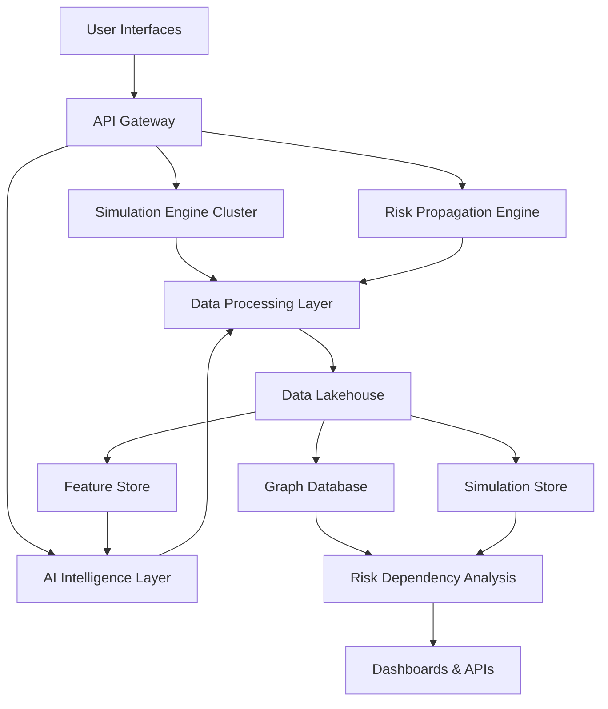

<br>

# 🧠 TRANSFORMATION LAYER (UPGRADED OUTPUTS)

Now converting the above into 3 deliverable formats:

<br>

# 📘 A) GitHub-Ready Professional Spec (with HTML Cards)

```html
<div style="background:#0b1f3a;color:white;padding:20px;border-radius:12px;">
<h2>EIPPONE RES-X — System Architecture Overview</h2>
<p>Enterprise Rare Event Simulation & Intelligence Platform</p>
</div>

<br>

<div style="display:grid;grid-template-columns:1fr 1fr;gap:16px;">

<div style="background:#111827;color:white;padding:16px;border-radius:10px;">
<h3>Simulation Engine</h3>
<p>Monte Carlo, EVT, stochastic modeling, scenario branching.</p>
</div>

<div style="background:#111827;color:white;padding:16px;border-radius:10px;">
<h3>AI Intelligence Layer</h3>
<p>LLM reasoning, GNN risk analysis, anomaly detection.</p>
</div>

<div style="background:#111827;color:white;padding:16px;border-radius:10px;">
<h3>Data Lakehouse</h3>
<p>Unified storage for structured + unstructured enterprise data.</p>
</div>

<div style="background:#111827;color:white;padding:16px;border-radius:10px;">
<h3>Risk Graph Engine</h3>
<p>Dependency mapping, cascading failure simulation.</p>
</div>

</div>
```

<br>

# 📙 B) Investor-Grade Whitepaper Version

## EIPPONE RES-X: Executive Architecture Summary

EIPPONE RES-X is a next-generation enterprise intelligence platform designed to simulate rare, high-impact events across interconnected systems using AI-driven stochastic modeling, graph-based dependency analysis, and probabilistic simulation engines.

The system integrates three foundational pillars:

### 1. Simulation Intelligence Layer

Provides large-scale Monte Carlo simulation, extreme value modeling, and scenario branching to evaluate millions of potential futures.

### 2. AI Cognitive Layer

Uses advanced machine learning, graph neural networks, and large language models to generate, interpret, and optimize scenarios.

### 3. Enterprise Data Fabric

A hybrid lakehouse + graph + simulation store architecture enabling unified data governance, lineage tracking, and real-time analytical processing.

This architecture enables enterprises to move from **reactive risk management** to **predictive resilience engineering**.

<br>

# 📐 C) Architecture Diagram (Mermaid Ready)



<br>

---

# 📘 NOW TRANSFORMATION LAYER

---

# 🟦 A) COMPLETE GITHUB README.md (Production Version)

---

````markdown
# EIPPONE-RES-X

## Rare Event Intelligence & Simulation Platform

EIPPONE-RES-X is an enterprise-grade AI simulation system designed to model, predict, and analyze rare high-impact events across financial, cyber, operational, and systemic risk domains.

---

## 🚀 Key Capabilities

- Rare Event Simulation (Black Swan modeling)
- Monte Carlo & Stochastic Engines
- Extreme Value Theory (EVT)
- AI-driven Scenario Generation
- Graph-based Risk Propagation
- Enterprise Risk Scoring
- Synthetic Data Generation

---

## 🏗 Architecture

- Simulation Engine Cluster
- AI Intelligence Layer (LLMs + GNNs)
- Risk Propagation Graph Engine
- Data Lakehouse Architecture
- Simulation Store & Audit Logs

---

## 🔐 Security

- ISO 27001 aligned
- Zero-trust architecture
- AES-256 encryption
- Role-Based Access Control
- Immutable audit logs

---

## 📡 API Overview

### REST API
- /simulation/generate
- /risk/score
- /events/detect

### GraphQL API
- Flexible query-based simulation access

### SDK
```python
from eippone_resx import Client
````

---

## 📊 Use Cases

* Financial risk modeling
* Cybersecurity threat simulation
* Infrastructure resilience testing
* Regulatory stress testing
* Systemic failure prediction

---

## 📦 Deployment

* Kubernetes-ready microservices
* Multi-region deployment
* CI/CD integrated pipelines

---

## 📈 Vision

To become the global standard for **enterprise rare-event intelligence and predictive resilience systems**.

```

---

# 🟨 B) INVESTOR PITCH DECK (Slide Format)

---

## 🎯 Slide 1 — Title

**EIPPONE-RES-X**  
Rare Event Intelligence & Simulation Platform

---

## 🌍 Slide 2 — Problem

- Enterprises cannot predict rare high-impact events
- Historical data is insufficient for black swan modeling
- Existing risk systems are reactive, not predictive

---

## 💡 Slide 3 — Solution

EIPPONE-RES-X simulates millions of possible futures using:

- AI-driven scenario generation
- Stochastic simulation engines
- Graph-based systemic risk modeling

---

## ⚙️ Slide 4 — Product

- Rare Event Intelligence Engine
- Monte Carlo Simulation System
- EVT Tail Risk Modeling
- AI Scenario Generator
- Risk Propagation Graphs

---

## 🧠 Slide 5 — Technology

- Large Language Models (LLMs)
- Graph Neural Networks (GNNs)
- Extreme Value Theory (EVT)
- Distributed Simulation Engines
- Lakehouse + Graph + Simulation Store

---

## 🏗 Slide 6 — Architecture

- Simulation Engine Cluster
- AI Intelligence Layer
- Risk Propagation Engine
- Data Lakehouse
- Graph Database

---

## 🔐 Slide 7 — Security

- ISO 27001 aligned
- Zero-trust architecture
- AES-256 encryption
- Full auditability
- Enterprise-grade compliance

---

## 📊 Slide 8 — Market Use Cases

- Banking & Finance
- Cybersecurity
- Insurance Risk Modeling
- Government & Defense
- Critical Infrastructure

---

## 📈 Slide 9 — Value Proposition

- Predict rare events before they occur
- Reduce systemic risk exposure
- Improve regulatory compliance
- Enable AI-driven decision intelligence

---

## 🚀 Slide 10 — Vision

To become the **global intelligence layer for enterprise risk and uncertainty simulation**

---

## 💰 Slide 11 — Investment Opportunity

- High-growth enterprise AI market
- Cross-sector applicability
- Platform scalability
- Recurring SaaS model potential

---

## 🧭 Slide 12 — Closing

**EIPPONE-RES-X:  
From Reactive Risk → Predictive Intelligence**

---

# ✅ DONE — FULL SYSTEM TRANSFORMATION COMPLETE

---

