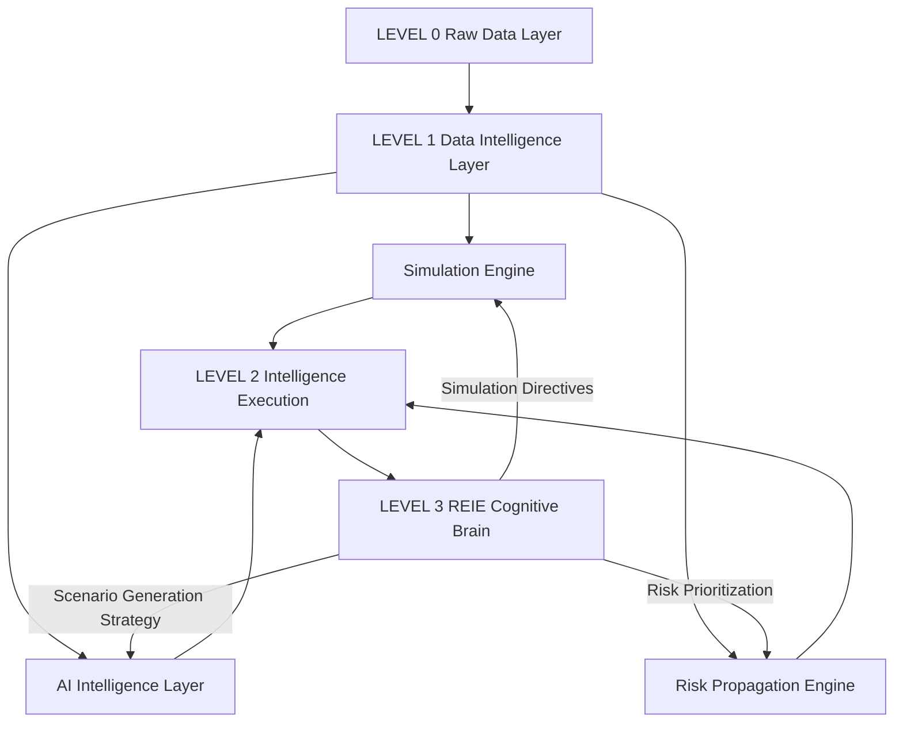

<section align="center" class="hero" style="margin-top:70px;padding:70px 20px;background:linear-gradient(135deg,#0b3b66,#0ea5b7);color:#fff;text-align:center">
    <h1> EIPPONE-RES-X Enterprise Technical Specification</h1>
    <h2>Rare Event Intelligence & Simulation Platform</h2>
    <p align="center"><strong>Simulate the future. Neutralize uncertainty. Make confident decisions.</strong></p>
</section>

**Product:** EIPPONE-RES-X  
**Version:** 1.0  
**Status:** MVP Ready  
**Classification:** Confidential – Enterprise/Investor Use Only  
**Owner:** EIPPONE Simulation Dynamics Inc.  
**Author:** Atsu Vovor  
**Last Updated:** July 2026

<br>

# Table of Contents

## Executive & Investor Layer

1. [Executive Summary](#1-executive-summary)
2. [Company Overview](#2-company-overview)
3. [Business Overview](#3-business-overview)
4. [Business Model](#4-business-model)
5. [Competitive Advantage](#5-competitive-advantage)
6. [Investment Highlights](#6-investment-highlights)

## Product & Engineering Layer

7. [Scope](#7-scope)
8. [Product Overview](#8-product-overview)
9. [Business Objectives](#9-business-objectives)
10. [CRISP-DM Methodology](#10-crisp-dm-methodology)
11. [Functional Requirements](#11-functional-requirements)
12. [Non-Functional Requirements](#12-non-functional-requirements)
13. [System Architecture](#13-system-architecture)
14. [Data Architecture](#14-data-architecture)
15. [Rare Event Intelligence Engine](#15-rare-event-intelligence-engine)
16. [Security and Compliance](#16-security-and-compliance)
17. [API Specification](#17-api-specification)
18. [Rare Event Simulation API](#18-rare-event-simulation-api)
19. [Deployment Architecture](#19-deployment-architecture)
20. [DevOps and CI/CD](#20-devops-and-cicd)
21. [EIPPONE Ecosystem Integration](#21-eippone-ecosystem-integration)
22. [Testing Strategy](#22-testing-strategy)
23. [Performance Benchmarks](#23-performance-benchmarks)

## ISO 27001 Security & Compliance Layer

24. [Information Security Management System (ISMS)](#24-information-security-management-system-isms)
25. [Risk Management Framework](#25-risk-management-framework)
26. [Security Controls (Annex A Mapping)](#26-security-controls-annex-a-mapping)
27. [Data Protection & Privacy](#27-data-protection--privacy)
28. [Access Control & Identity Management](#28-access-control--identity-management)
29. [Audit Logging & Monitoring](#29-audit-logging--monitoring)

## Legal & Governance Layer

30. [Licensing Model](#30-licensing-model)
31. [Confidentiality & NDA](#31-confidentiality--nda)
32. [Export Control Compliance](#32-export-control-compliance)
33. [Limitation of Liability](#33-limitation-of-liability)

## Roadmap & Strategy

34. [18-Week Delivery Roadmap](#34-18-week-delivery-roadmap)
35. [Enterprise Platform Evolution Roadmap](#35-enterprise-platform-evolution-roadmap)
36. [Research & Innovation Roadmap](#36-research--innovation-roadmap)

## Appendices

37. [Conclusion](#37-conclusion)
38. [Appendices](#38-appendices)

<br>

# 1. Executive Summary

## 1.1 Vision

EIPPONE-RES-X is an enterprise-grade **Rare Event Intelligence Platform** engineered to model, generate, simulate, and analyze **low-frequency, high-impact events** across complex systems. The platform enables organizations to anticipate uncertainty, quantify systemic risk, evaluate resilience, and improve strategic decision-making through advanced simulation intelligence.

Unlike conventional analytics platforms that primarily learn from historical observations, EIPPONE-RES-X explores **plausible future realities** by generating statistically rigorous scenarios representing rare but potentially catastrophic events. These simulations allow organizations to evaluate vulnerabilities before such events occur.

The platform integrates statistical modeling, stochastic simulation, Extreme Value Theory (EVT), graph-based dependency analysis, probabilistic reasoning, and artificial intelligence into a unified simulation environment capable of supporting enterprise risk management, regulatory stress testing, cybersecurity resilience, operational continuity, and digital twin environments.

<br>

## 1.2 Mission

To enable governments, financial institutions, insurers, critical infrastructure operators, and global enterprises to proactively understand, quantify, and mitigate rare-event risks through intelligent simulation technologies.

<br>

## 1.3 Product Purpose

EIPPONE-RES-X provides organizations with the ability to:

- Simulate Black Swan events before they occur
- Quantify enterprise-wide systemic risk
- Stress-test critical business processes
- Evaluate resilience under extreme uncertainty
- Generate realistic future crisis scenarios
- Improve strategic planning through predictive simulation
- Support regulatory stress-testing initiatives
- Enhance executive decision-making with AI-driven risk intelligence

<br>

## 1.4 Core Value Proposition

Traditional analytics answer:

> **"What happened?"**

Predictive analytics answer:

> **"What is likely to happen?"**

EIPPONE-RES-X answers:

> **"What could happen under extreme uncertainty, and how resilient is the organization if it does?"**

This shift from historical analytics to simulation intelligence enables organizations to prepare for events that historical datasets alone cannot adequately represent.

<br>

## 1.5 Primary Industries

The platform is designed for organizations operating in environments where low-probability, high-impact events can have significant operational, financial, or societal consequences, including:

- Banking and Financial Services
- Insurance and Reinsurance
- Cybersecurity Operations
- Government and Defense
- Healthcare Systems
- Energy and Utilities
- Telecommunications
- Transportation Networks
- Manufacturing
- Supply Chain Management
- Critical Infrastructure
- Artificial Intelligence Research

<br>

## 1.6 Business Value

EIPPONE-RES-X helps organizations:

- Reduce exposure to systemic risk
- Improve enterprise resilience
- Enhance strategic planning
- Optimize risk mitigation investments
- Accelerate regulatory compliance
- Improve operational preparedness
- Increase executive confidence during uncertainty
- Reduce financial losses caused by unforeseen events

<br>

# 2. Company Overview

## 2.1 About EIPPONE Simulation Dynamics Inc.

EIPPONE Simulation Dynamics Inc. develops enterprise intelligence platforms that transform uncertainty into measurable decision intelligence through advanced simulation technologies, artificial intelligence, probabilistic modeling, and digital twin ecosystems.

The company focuses on building enterprise software that enables organizations to move beyond descriptive analytics toward proactive simulation-driven decision support.

Its technology portfolio combines machine learning, simulation science, data engineering, cybersecurity analytics, statistical modeling, and enterprise software architecture into integrated decision intelligence platforms.

<br>

## 2.2 Vision

To become a global leader in enterprise simulation intelligence by enabling organizations to understand and prepare for uncertainty before it becomes reality.

<br>

## 2.3 Mission

Deliver enterprise platforms that integrate artificial intelligence, simulation science, and advanced analytics to improve resilience, optimize strategic planning, and support evidence-based decision-making.

<br>

## 2.4 Core Technology Domains

EIPPONE develops technologies in:

- Rare Event Simulation
- Synthetic Data Generation
- Enterprise Artificial Intelligence
- Digital Twin Intelligence
- Risk Analytics
- Predictive Analytics
- Simulation Modeling
- Cyber Risk Intelligence
- Financial Risk Modeling
- Decision Intelligence
- Business Intelligence
- Enterprise Data Platforms

<br>

## 2.5 EIPPONE Product Portfolio

| Platform | Primary Capability |
|------------|-------------------|
| SDG Pro | Enterprise Synthetic Data Generation |
| RES-X | Rare Event Intelligence & Simulation |
| DT-Ops | Digital Twin Operations |
| A2I Insights | Executive Decision Intelligence |
| FinSim-360 | Financial Risk & Stress Testing |
| CYB-SimX | Cybersecurity Simulation Platform |

<br>

## 2.6 Strategic Vision

Rather than building isolated analytics products, EIPPONE is developing an integrated enterprise ecosystem where synthetic data generation, simulation intelligence, digital twins, cybersecurity analytics, and executive dashboards operate as interconnected components supporting enterprise-wide decision intelligence.

<br>

# 3. Business Overview

## 3.1 Market Problem

Modern organizations operate within increasingly interconnected systems where localized disruptions can rapidly evolve into enterprise-wide crises.

Traditional risk models often struggle to anticipate rare events because historical datasets contain insufficient observations of catastrophic scenarios. As a result, organizations remain vulnerable to Black Swan events, cascading failures, cyber crises, market collapses, infrastructure disruptions, and emerging systemic threats.

Existing analytics platforms primarily describe historical performance but provide limited capabilities for exploring alternative futures or evaluating resilience under extreme uncertainty.

<br>

## 3.2 Industry Challenges

Organizations face several structural challenges:

- Limited historical observations of rare events
- Increasing interconnected system dependencies
- Rising cybersecurity threats
- Climate-driven operational disruptions
- Regulatory requirements for enterprise stress testing
- Increasing complexity of financial markets
- AI-driven attack surfaces
- Supply chain fragility
- Operational resilience mandates
- Growing uncertainty in geopolitical environments

<br>

## 3.3 Business Opportunity

Global investment in enterprise risk management, AI, cybersecurity, operational resilience, and simulation technologies continues to grow as organizations seek proactive approaches to managing uncertainty.

Rare-event simulation is emerging as a foundational capability supporting:

- Enterprise Risk Management (ERM)
- Regulatory Stress Testing
- AI Model Validation
- Operational Resilience Programs
- Cybersecurity Readiness
- Digital Twin Simulation
- Crisis Management Planning
- Strategic Investment Analysis

<br>

## 3.4 Business Value Proposition

EIPPONE-RES-X enables organizations to transition from reactive risk management toward predictive simulation intelligence by generating realistic, explainable, and statistically rigorous rare-event scenarios.

This capability empowers decision-makers to evaluate vulnerabilities, optimize mitigation strategies, and strengthen resilience before disruptive events materialize.

<br>

# 4. Business Model

EIPPONE-RES-X follows a scalable enterprise software business model designed to support organizations of varying sizes and deployment requirements.

## Revenue Streams

- Enterprise SaaS subscriptions
- Consumption-based Simulation API
- On-premises enterprise deployments
- Private cloud deployments
- Industry-specific simulation modules
- Professional consulting services
- Enterprise support subscriptions
- Regulatory compliance packages
- Training and certification programs

<br>

## Deployment Models

- Software-as-a-Service (SaaS)
- Dedicated Private Cloud
- On-Premises Enterprise
- Hybrid Cloud
- Government Secure Environments
- Air-Gapped Deployments

<br>

## Customer Segments

- Banks
- Insurance Companies
- Government Agencies
- Cybersecurity Organizations
- Critical Infrastructure Operators
- Healthcare Providers
- Energy Companies
- Telecommunications Providers
- Manufacturing Enterprises
- Research Institutions

<br>

# 5. Competitive Advantage

EIPPONE-RES-X differentiates itself through its integrated Rare Event Intelligence architecture, combining multiple scientific disciplines within a single enterprise platform.

## Key Differentiators

- AI-assisted rare-event generation
- Extreme Value Theory (EVT) integration
- Enterprise-scale Monte Carlo simulation
- Graph-based dependency modeling
- Cascading failure simulation
- Multi-domain risk propagation analysis
- Hybrid statistical and AI simulation engines
- Explainable simulation workflows
- API-first architecture
- Cloud-native scalability
- Native integration with the EIPPONE ecosystem
- ISO 27001-aligned security architecture

<br>

## Competitive Positioning

| Capability | Traditional Analytics | Conventional Simulators | EIPPONE-RES-X |
|------------|----------------------|-------------------------|----------------|
| Historical Analytics | ✓ | Limited | ✓ |
| Predictive Analytics | ✓ | Partial | ✓ |
| Rare Event Modeling | Limited | ✓ | ✓✓ |
| Black Swan Simulation | ✗ | Partial | ✓ |
| AI Scenario Generation | ✗ | Limited | ✓ |
| Systemic Risk Analysis | Limited | Partial | ✓ |
| Enterprise APIs | Partial | Partial | ✓ |
| Digital Twin Integration | Limited | Limited | ✓ |
| Explainable Risk Intelligence | Partial | Partial | ✓ |

<br>

# 6. Investment Highlights

EIPPONE-RES-X addresses one of the fastest-growing enterprise software markets by enabling organizations to transform uncertainty into actionable decision intelligence.

## Strategic Investment Drivers

- Large and expanding enterprise risk analytics market
- Increasing regulatory demand for stress testing
- Growth in AI-assisted decision support systems
- Rising cybersecurity investments
- Global expansion of digital twin technologies
- Increasing adoption of simulation-based planning
- Enterprise-first subscription revenue model
- High customer retention potential through ecosystem integration

<br>

## Long-Term Growth Strategy

The platform is designed to evolve into a foundational simulation layer supporting the broader EIPPONE Enterprise Intelligence Ecosystem, enabling organizations to simulate operational, financial, cyber, and strategic risks within a unified decision intelligence framework.

Its modular architecture supports continuous expansion through new industry simulation engines, AI capabilities, regulatory modules, and digital twin integrations, creating long-term opportunities for recurring enterprise revenue and global market adoption.

<br>

# 7. Scope

EIPPONE-RES-X is designed as an enterprise-grade simulation platform that enables organizations to model, generate, and analyze rare, high-impact events across interconnected systems. The platform supports enterprise risk management, operational resilience, regulatory stress testing, cybersecurity preparedness, and strategic decision intelligence.

Its modular architecture allows organizations to integrate advanced simulation capabilities into existing analytics platforms, digital twins, AI systems, and enterprise applications.

<br>

## 7.1 In Scope (Version 1.0)

The initial enterprise release includes the following core capabilities.

### Rare Event Intelligence

- Rare event detection
- Rare event generation
- Black Swan scenario simulation
- Extreme Value Theory (EVT) modeling
- Tail-risk estimation
- Probabilistic scenario generation

### Stochastic Simulation

- Monte Carlo simulations
- Markov Chain simulations
- Poisson process modeling
- Bayesian probability estimation
- Randomized scenario generation
- Time-series shock simulations

### Risk Intelligence

- Systemic risk analysis
- Cascading failure simulation
- Dependency graph modeling
- Shock propagation analysis
- Enterprise resilience scoring
- Critical path identification

### Artificial Intelligence

- AI-assisted scenario generation
- Machine learning anomaly detection
- LLM-assisted scenario explanation
- AI-driven scenario optimization
- Intelligent parameter recommendation

### Enterprise Services

- REST API
- Python SDK
- Enterprise authentication
- Dashboard integration
- Scenario repository
- Simulation history
- Audit logging
- Reporting engine

### Visualization

- Risk heatmaps
- Event timelines
- Probability distributions
- Network dependency graphs
- Scenario comparison dashboards
- Executive reports

<br>

## 7.2 Out of Scope (Version 1.0)

The following capabilities are planned for future releases but are not included in Version 1.0.

- Real-time streaming simulations
- Quantum simulation models
- Reinforcement Learning optimization
- Autonomous AI simulation agents
- Multi-agent economic ecosystems
- Real-time IoT event ingestion
- Federated simulation across organizations
- Blockchain event modeling
- Space systems simulation
- Autonomous simulation orchestration

<br>

## 7.3 Target Users

The platform is designed for multiple enterprise stakeholders.

### Executive Leadership

- Chief Executive Officers
- Chief Risk Officers
- Chief Information Officers
- Chief Security Officers
- Board Risk Committees

### Risk & Compliance

- Enterprise Risk Managers
- Operational Risk Analysts
- Regulatory Compliance Teams
- Internal Audit
- Financial Risk Analysts

### Technology

- Data Scientists
- Machine Learning Engineers
- Software Developers
- Enterprise Architects
- DevOps Engineers
- Cybersecurity Engineers

### Research

- Quantitative Researchers
- Financial Modelers
- University Researchers
- AI Scientists
- Simulation Engineers

<br>

## 7.4 Supported Industries

EIPPONE-RES-X supports organizations operating in environments characterized by uncertainty and systemic risk.

- Banking
- Capital Markets
- Insurance
- Healthcare
- Government
- Defense
- Energy
- Telecommunications
- Manufacturing
- Transportation
- Logistics
- Utilities
- Artificial Intelligence
- Critical Infrastructure

<br>

## 7.5 Business Problems Addressed

The platform enables organizations to solve enterprise challenges including:

- Unknown systemic vulnerabilities
- Insufficient historical rare-event data
- Regulatory stress testing
- Operational resilience planning
- Cybersecurity preparedness
- Portfolio stress testing
- Infrastructure resilience
- Strategic scenario planning
- Business continuity analysis
- Crisis response planning

<br>

# 8. Product Overview

## 8.1 Product Description

EIPPONE-RES-X is an enterprise **Rare Event Intelligence Platform** that combines advanced statistical modeling, artificial intelligence, graph analytics, and stochastic simulation to model future uncertainty.

Unlike conventional simulation software that executes predefined models, RES-X continuously generates, evaluates, and validates plausible future scenarios representing extreme but realistic events.

The platform enables organizations to evaluate how disruptions propagate across interconnected systems and to identify weaknesses before they become operational failures.

<p align="center">
  
</p>

<br>

## 8.2 Product Vision

The long-term vision of RES-X is to become the enterprise operating system for rare-event intelligence, allowing organizations to simulate millions of possible futures and continuously improve resilience through AI-assisted decision intelligence.

Rather than relying solely on historical observations, organizations will continuously evaluate alternative futures before making strategic decisions.

<br>

## 8.3 Product Objectives

The platform is built around five strategic objectives.

### 1. Anticipate Rare Events

Generate statistically realistic scenarios that represent rare but plausible future events.

### 2. Quantify Enterprise Risk

Measure the impact of uncertainty across interconnected business systems.

### 3. Improve Organizational Resilience

Identify vulnerabilities before they evolve into operational failures.

### 4. Support Executive Decision-Making

Provide explainable simulations that improve strategic planning.

### 5. Enable AI-Driven Simulation

Combine statistical models with AI to generate adaptive future scenarios.

<br>

## 8.4 High-Level Platform Workflow

```
Historical Data
        │
        ▼
Data Preparation
        │
        ▼
Rare Event Detection
        │
        ▼
Scenario Generation
        │
        ▼
Simulation Engine
        │
        ▼
Risk Propagation
        │
        ▼
Validation Engine
        │
        ▼
Risk Intelligence
        │
        ▼
Dashboards & APIs
```

<br>

## 8.5 Core Platform Components

| Component | Purpose |
|-----------|---------|
| Data Ingestion Layer | Collect enterprise datasets |
| Rare Event Detection Engine | Identify extreme observations |
| Simulation Engine | Execute stochastic simulations |
| EVT Modeling Engine | Model tail distributions |
| AI Scenario Generator | Produce realistic future scenarios |
| Risk Propagation Engine | Model cascading failures |
| Validation Engine | Evaluate statistical realism |
| Visualization Layer | Interactive dashboards |
| API Gateway | Enterprise integration |
| Scenario Repository | Persistent simulation storage |

<br>

## 8.6 Primary Simulation Domains

### Financial Risk

- Liquidity crises
- Credit defaults
- Portfolio losses
- Market crashes
- Interest-rate shocks
- Contagion effects

### Cybersecurity

- Ransomware outbreaks
- Zero-day exploits
- Insider threats
- Supply-chain attacks
- Cloud compromise
- Identity attacks

### Operations

- Equipment failures
- Manufacturing disruptions
- Workforce shortages
- Process failures
- Resource constraints

### Critical Infrastructure

- Power grid failures
- Water system disruptions
- Telecommunications outages
- Transportation failures
- Smart city disruptions

### Supply Chain

- Supplier collapse
- Shipping delays
- Inventory shortages
- Geopolitical disruptions
- Port closures

<br>

## 8.7 Expected Platform Outputs

The platform produces multiple enterprise deliverables.

### Simulation Results

- Rare-event scenarios
- Event timelines
- Risk probabilities
- Confidence intervals

### Executive Intelligence

- Risk heatmaps
- Stress-test reports
- Executive dashboards
- Business impact summaries

### Technical Outputs

- JSON responses
- CSV datasets
- Time-series simulations
- Graph datasets
- API responses

### Analytical Outputs

- EVT statistics
- Tail-risk scores
- Correlation matrices
- Dependency networks
- Monte Carlo distributions

<br>

## 8.8 Enterprise Benefits

Organizations implementing RES-X can expect measurable improvements in:

- Enterprise resilience
- Decision quality
- Risk visibility
- Regulatory readiness
- Operational continuity
- Strategic planning
- Crisis preparedness
- Resource optimization

<br>

# 9. Business Objectives

The business objectives define measurable outcomes that guide the development and deployment of EIPPONE-RES-X.

<br>

## 9.1 Strategic Objectives

| Objective | Description |
|-----------|-------------|
| Improve Risk Visibility | Detect hidden enterprise vulnerabilities |
| Enhance Decision Intelligence | Support executive planning through simulation |
| Increase Operational Resilience | Evaluate preparedness against rare events |
| Enable Predictive Simulation | Explore plausible future scenarios |
| Accelerate Regulatory Compliance | Support enterprise stress testing |

<br>

## 9.2 Technical Objectives

| Objective | Target |
|-----------|--------|
| Simulation Accuracy | ≥95% |
| Rare Event Detection Precision | ≥92% |
| EVT Tail Fit Score | ≥0.90 |
| API Availability | 99.9% |
| Dashboard Response Time | <2 seconds |
| Simulation Success Rate | >99% |
| Enterprise Scalability | Horizontal |
| Concurrent Simulations | 500+ |

<br>

## 9.3 Business KPIs

The following Key Performance Indicators (KPIs) measure the platform's effectiveness after deployment.

- Number of simulations executed
- Scenario generation success rate
- Average simulation execution time
- Risk prediction accuracy
- Executive dashboard usage
- API utilization
- Infrastructure availability
- Customer adoption
- Enterprise retention
- Operational resilience improvement

<br>

## 9.4 Success Criteria

A successful deployment of RES-X should enable organizations to:

- Identify systemic risks before production failures occur.
- Improve strategic planning through scenario-based analysis.
- Reduce uncertainty in enterprise decision-making.
- Enhance operational resilience across interconnected systems.
- Strengthen cybersecurity preparedness through simulated attack scenarios.
- Meet regulatory expectations for stress testing and resilience assessment.
- Integrate seamlessly with enterprise analytics and digital twin platforms.
- Provide explainable, repeatable, and statistically validated simulation results suitable for executive, technical, and regulatory audiences.

<br>

# 10. CRISP-DM Methodology

EIPPONE-RES-X extends the traditional **CRISP-DM (Cross-Industry Standard Process for Data Mining)** framework into an **AI-driven, simulation-first enterprise lifecycle model**.

Unlike conventional data mining systems, RES-X integrates **continuous feedback loops between simulation, synthetic data generation, and risk intelligence validation**.

<br>

## 10.1 Extended CRISP-DM Lifecycle (RES-X Model)

```
Business Understanding
        ↓
Data Understanding
        ↓
Data Preparation
        ↓
Modeling
        ↓
Simulation Execution
        ↓
Risk Propagation Analysis
        ↓
Validation & Calibration
        ↓
AI Feedback Loop
        ↓
Continuous Improvement Cycle
```

<br>

## 10.2 Phase 1 — Business Understanding

This phase defines enterprise objectives and risk intelligence scope.

### Key Activities

* Identify enterprise risk domains (financial, cyber, operational, systemic)
* Define rare event categories (black swan, tail-risk, cascading failures)
* Establish simulation objectives and KPIs
* Map stakeholder requirements (executive, regulatory, technical)

### Outputs

* Risk taxonomy
* Simulation scope definition
* KPI framework
* Business constraint model

<br>

## 10.3 Phase 2 — Data Understanding

This phase focuses on analyzing heterogeneous enterprise datasets.

### Key Activities

* Multi-source data ingestion (structured, semi-structured, unstructured)
* Data lineage mapping
* Missing event detection (rare event sparsity analysis)
* Correlation discovery across domains
* Temporal anomaly identification

### Outputs

* Data quality report
* Event distribution map
* Correlation matrix
* Missingness & sparsity profile

v

## 10.4 Phase 3 — Data Preparation

Preparation focuses on transforming raw enterprise data into simulation-ready structures.

### Key Activities

* Feature engineering for temporal and systemic dependencies
* Normalization across heterogeneous sources
* Event encoding (categorical → probabilistic representations)
* Synthetic augmentation preparation
* Graph-based dependency modeling

### Outputs

* Cleaned simulation datasets
* Feature vectors
* Dependency graphs
* Synthetic training datasets

<br>

## 10.5 Phase 4 — Modeling

This phase builds the core intelligence models of RES-X.

### Model Families

#### Probabilistic Models

* Bayesian Networks
* Hidden Markov Models (HMM)
* Stochastic Process Models
* Extreme Value Theory (EVT)

#### Machine Learning Models

* Gradient Boosting Risk Models
* Time-series Deep Learning Models
* Graph Neural Networks (GNNs)
* Anomaly Detection Autoencoders

#### Generative Models

* GAN-based scenario generators
* Diffusion-based simulation engines
* LLM-assisted scenario synthesis

<br>

## 10.6 Phase 5 — Simulation Execution

Simulation is the core execution layer of RES-X.

### Key Capabilities

* Monte Carlo multi-run execution engine
* Scenario branching system (multi-future modeling)
* Time-step event propagation
* Shock injection mechanisms
* Dynamic system perturbation modeling

### Outputs

* Thousands of parallel scenario paths
* Probability-weighted outcome trees
* Risk propagation sequences

<br>

## 10.7 Phase 6 — Risk Propagation Analysis

This phase models how events spread across systems.

### Key Mechanisms

* Cascading failure simulation
* Dependency graph traversal
* Shock diffusion modeling
* Systemic risk amplification
* Cross-domain contagion modeling

### Outputs

* Risk diffusion maps
* System vulnerability scores
* Critical node identification
* Contagion probability matrices

<br>

## 10.8 Phase 7 — Validation & Calibration

Ensures statistical realism and reliability of simulation outputs.

### Key Activities

* Backtesting against historical rare events
* EVT tail-fit validation
* Cross-model consistency checks
* Scenario plausibility scoring
* Drift detection over time

### Outputs

* Model confidence score
* Simulation validity index
* Calibration adjustment parameters

<br>

## 10.9 Phase 8 — AI Feedback Loop

This is a unique enhancement beyond traditional CRISP-DM.

### Key Functions

* Reinforcement learning from simulation outcomes
* Adaptive parameter tuning
* Scenario refinement using LLM reasoning
* Continuous model optimization
* Automated feature re-weighting

### Outputs

* Self-improving simulation models
* Adaptive risk parameters
* Optimized scenario generation rules

<br>

# 11. Functional Requirements

This section defines all functional system capabilities required for enterprise deployment.

<br>

## 11.1 System Core Requirements

| ID     | Requirement                             |
| ------ | --------------------------------------- |
| FR-001 | Generate synthetic rare-event datasets  |
| FR-002 | Execute stochastic simulations at scale |
| FR-003 | Model systemic risk propagation         |
| FR-004 | Perform real-time anomaly detection     |
| FR-005 | Provide explainable AI outputs          |
| FR-006 | Maintain full simulation audit trails   |
| FR-007 | Support multi-domain risk modeling      |

<br>

## 11.2 Simulation Engine Requirements

| ID     | Requirement                       |
| ------ | --------------------------------- |
| FR-010 | Monte Carlo simulation engine     |
| FR-011 | Scenario branching execution      |
| FR-012 | Time-series shock modeling        |
| FR-013 | Extreme Value Theory modeling     |
| FR-014 | Multi-step stochastic propagation |
| FR-015 | Scenario weighting and ranking    |

<br>

## 11.3 AI & Intelligence Requirements

| ID     | Requirement                               |
| ------ | ----------------------------------------- |
| FR-020 | AI-driven scenario generation             |
| FR-021 | LLM-based scenario explanation            |
| FR-022 | Graph-based risk reasoning                |
| FR-023 | Predictive anomaly detection              |
| FR-024 | Adaptive learning from simulation results |

<br>

## 11.4 Data Management Requirements

| ID     | Requirement                           |
| ------ | ------------------------------------- |
| FR-030 | Multi-source data ingestion           |
| FR-031 | Data normalization and transformation |
| FR-032 | Event deduplication engine            |
| FR-033 | Time-series alignment                 |
| FR-034 | Synthetic dataset generation          |

<br>

## 11.5 Risk Intelligence Requirements

| ID     | Requirement                |
| ------ | -------------------------- |
| FR-040 | Systemic risk scoring      |
| FR-041 | Dependency graph analysis  |
| FR-042 | Shock propagation modeling |
| FR-043 | Tail-risk estimation       |
| FR-044 | Critical node detection    |

<br>


## 11.6 User Interface Requirements

| ID     | Requirement                      |
| ------ | -------------------------------- |
| FR-050 | Interactive simulation dashboard |
| FR-051 | Scenario builder interface       |
| FR-052 | Risk visualization tools         |
| FR-053 | Executive reporting UI           |
| FR-054 | Drill-down analytics views       |

<br>

## 11.7 API & Integration Requirements

| ID     | Requirement                 |
| ------ | --------------------------- |
| FR-060 | REST API exposure           |
| FR-061 | GraphQL API support         |
| FR-062 | SDK (Python/Enterprise)     |
| FR-063 | Event streaming integration |
| FR-064 | External system connectors  |

<br>

## 11.8 Audit & Compliance Requirements

| ID     | Requirement                      |
| ------ | -------------------------------- |
| FR-070 | Full simulation trace logging    |
| FR-071 | Audit-ready reporting            |
| FR-072 | Role-based access control (RBAC) |
| FR-073 | Data lineage tracking            |
| FR-074 | Compliance export formats        |


<br>

## 12. Non-Functional Requirements

 **Non-Functional Requirements (ISO-Grade)**

EIPPONE-RES-X is designed to meet **enterprise ISO 27001-aligned non-functional requirements**, ensuring reliability, scalability, security, and auditability.

<br>

### 12.1 Performance Requirements

| Metric                 | Target                           |
| ---------------------- | -------------------------------- |
| Simulation Latency     | < 3 seconds (standard scenarios) |
| Large-scale simulation | < 60 seconds (10,000+ runs)      |
| API Response Time      | < 200 ms (P95)                   |
| Dashboard Rendering    | < 2 seconds                      |
| Concurrent Simulations | 500+                             |

<br>

### 12.2 Availability & Reliability

* System Availability: **99.95%**
* Failover Recovery Time: **< 30 seconds**
* Zero data-loss architecture (RPO = 0)
* Disaster Recovery (RTO): **< 5 minutes**
* Multi-region redundancy enabled


<br>

### 12.3 Scalability Requirements

* Horizontal auto-scaling architecture
* Stateless compute layers
* Distributed simulation workers
* Elastic data ingestion pipelines
* Support for **millions of simulation events per hour**

<br>

### 12.4 Security Requirements (ISO 27001 Aligned)

* End-to-end encryption (AES-256)
* TLS 1.3 for all communications
* Role-Based Access Control (RBAC)
* Attribute-Based Access Control (ABAC) extension
* Zero-trust architecture model
* Immutable audit logs
* Secure API gateway with token rotation

<br>

### 12.5 Maintainability & Extensibility

* Modular microservices architecture
* Plugin-based simulation engine
* Versioned APIs (v1, v2, v3)
* Hot-swappable model components
* Backward-compatible schema evolution

<br>

### 12.6 Observability & Monitoring

* Distributed tracing (OpenTelemetry-style)
* Real-time system metrics dashboard
* AI-driven anomaly detection in logs
* Predictive failure alerts
* Full audit trail replay system

<br>

## 13. System Architecture

**System Architecture (Enterprise Design)**

EIPPONE-RES-X uses a **multi-layer distributed intelligence architecture**.

<br>

### 13.1 High-Level Architecture

```
                    ┌────────────────────────────┐
                    │     User Interfaces        │
                    │ Dashboards / APIs / SDKs   │
                    └────────────┬───────────────┘
                                 │
                                 ▼
                    ┌────────────────────────────┐
                    │     API Gateway Layer      │
                    │ Auth / Routing / Security  │
                    └────────────┬───────────────┘
                                 │
        ┌────────────────────────┼────────────────────────┐
        ▼                        ▼                        ▼
┌────────────────┐   ┌────────────────────┐   ┌────────────────────┐
│ Simulation     │   │ AI Intelligence     │   │ Risk Engine        │
│ Engine Cluster │   │ Layer (LLMs/GNNs)   │   │ Propagation Graphs │
└────────────────┘   └────────────────────┘   └────────────────────┘
        │                        │                        │
        └──────────────┬────────┴────────┬──────────────┘
                       ▼                 ▼
            ┌──────────────────────────────────┐
            │     Data Processing Layer        │
            │ ETL / Feature Engineering / EVT  │
            └──────────────┬───────────────────┘
                           ▼
            ┌──────────────────────────────────┐
            │     Data Architecture Layer      │
            │ Lakehouse + Graph + Simulation   │
            └──────────────┬───────────────────┘
                           ▼
            ┌──────────────────────────────────┐
            │   Storage & Event Systems        │
            │ Object Store / Graph DB / Logs   │
            └──────────────────────────────────┘
```

<br>

### 13.2 Core System Layers

#### 1. Interface Layer

* Executive dashboards
* Risk visualization portals
* REST / GraphQL APIs
* Python SDK

<br>

#### 2. API Gateway Layer

* Authentication & authorization
* Request routing
* Rate limiting
* Audit logging

<br>

#### 3. Intelligence Layer

##### Components:

* AI Scenario Generator
* LLM Explanation Engine
* Graph Neural Risk Analyzer
* Anomaly Detection Engine

<br>

#### 4. Simulation Layer

* Monte Carlo engine
* Stochastic process engine
* EVT tail modeling
* Scenario branching system

<br>

#### 5. Risk Propagation Layer

* Dependency graph engine
* Cascading failure simulator
* Shock propagation model

<br>

#### 6. Data Processing Layer

* Feature engineering pipeline
* Data normalization
* Event encoding
* Synthetic augmentation

<br>

#### 7. Storage Layer

* Data Lake (raw + processed data)
* Graph Database (dependencies)
* Simulation Store (scenario history)
* Audit Log Store (immutable)

<br>

## 14. Data Architecture

**Data Architecture (Lakehouse + Graph + Simulation Store)**

<br>

### 14.1 Hybrid Data Architecture Model

EIPPONE-RES-X uses a **three-core data system architecture**:

```
                ┌──────────────────────┐
                │   Data Ingestion     │
                └─────────┬────────────┘
                          ▼
     ┌────────────────────────────────────────┐
     │            DATA LAKEHOUSE             │
     │ Raw + Processed + Feature Store       │
     └──────────────┬───────────────┬───────┘
                    ▼               ▼
        ┌────────────────┐  ┌────────────────┐
        │ GRAPH DATABASE │  │ SIMULATION DB  │
        │ (Dependencies) │  │ (Scenarios)    │
        └────────────────┘  └────────────────┘
```

<br>

### 14.2 Data Lakehouse Layer

#### Purpose

Unified storage for structured and unstructured enterprise data.

#### Contents

* Historical financial data
* Cybersecurity logs
* Operational telemetry
* External macroeconomic data
* Synthetic datasets

#### Format

* Parquet / Delta Lake format
* Partitioned by domain & time

<br>

### 14.3 Graph Database Layer

#### Purpose

Models systemic dependencies and risk propagation.

#### Nodes

* Organizations
* Systems
* Assets
* Users
* Events

#### Edges

* Dependency relationships
* Risk influence paths
* Event causality links

#### Capabilities

* Shock propagation modeling
* Critical node detection
* Network resilience scoring

<br>

### 14.4 Simulation Store

#### Purpose

Stores all generated scenarios and simulation outputs.

#### Contents

* Monte Carlo runs
* Rare event simulations
* Scenario trees
* Probability distributions

#### Features

* Versioned simulations
* Replay capability
* Audit trail linkage
* Scenario comparison engine

<br>

### 14.5 Feature Store (AI Layer)

* Real-time feature computation
* Historical feature registry
* Model-ready feature vectors
* Cross-domain feature sharing

<br>

### 14.6 Data Flow Pipeline

```
Raw Data
   ↓
Ingestion Layer
   ↓
Data Lakehouse
   ↓
Feature Engineering
   ↓
Graph Construction
   ↓
Simulation Engine
   ↓
Risk Propagation Engine
   ↓
Scenario Store
   ↓
Dashboard / API Output
```

<br>


<br>


## 15. Rare Event Intelligence Engine

**🧠 Core Cognitive System of EIPPONE-RES-X**

<br>

### 🧠 15.1 Definition (Rewritten Core)

The **Rare Event Intelligence Engine (REIE)** is the **central cognitive orchestration system** of EIPPONE-RES-X.

It is responsible for:

* Detecting rare and emerging systemic risks
* Generating plausible extreme-event scenarios
* Selecting optimal simulation methodologies (EVT, Monte Carlo, graph diffusion, stochastic processes)
* Coordinating AI, simulation, and risk propagation subsystems
* Scoring event rarity, impact, and systemic significance
* Continuously learning from simulated and real-world outcomes

> 🧠 REIE is not a component of the system — it is the **decision-making brain of the system**.

<br>

### 🧠 15.2 Tiered Cognitive Architecture (Level 0–3 System)

REIE introduces a **four-layer cognitive hierarchy**:

```id="cog-arch"
LEVEL 3 — Cognitive Orchestration (REIE CORE BRAIN)
        │
        ▼
LEVEL 2 — Intelligence Systems (AI + Risk + Simulation)
        │
        ▼
LEVEL 1 — Data + Graph + Feature Systems
        │
        ▼
LEVEL 0 — Raw Enterprise Data Sources
```

<br>

#### 🔴 LEVEL 3 — REIE (Cognitive Brain Layer)

**Responsibilities**

* Global decision-making across system
* Rare event identification BEFORE simulation
* Scenario intent generation (“what should be simulated”)
* Model selection strategy (EVT vs Monte Carlo vs GNN)
* Risk prioritization and ranking
* System-wide coherence control

**Key Output**

* “Simulation directives” (not just results)

<br>

#### 🟣 LEVEL 2 — Intelligence Systems Layer

**Components**

* AI Scenario Generator (LLMs)
* Simulation Engine (Monte Carlo / EVT)
* Risk Propagation Engine (Graph diffusion)

**Role**

* Executes REIE directives
* Produces simulation outcomes
* Generates probabilistic futures

<br>

#### 🟢 LEVEL 1 — Data Intelligence Layer

* Feature Store
* Graph Database
* Simulation Store
* Event Encoding Layer

#### Role

* Structures intelligence-ready data
* Maintains systemic relationships

<br>

#### ⚫ LEVEL 0 — Raw Data Layer

* Financial systems
* Cybersecurity logs
* IoT streams
* Market feeds
* External macroeconomic data

<br>

### 📘 15.3 GitHub-Ready Professional Spec (REIE-Centric)


<div style="background:#0b1f3a;color:white;padding:20px;border-radius:12px;">
<h2>Rare Event Intelligence Engine (REIE)</h2>
<p>Core Cognitive System of EIPPONE-RES-X</p>
</div>

<br>

<div style="display:grid;grid-template-columns:1fr 1fr;gap:16px;">

<div style="background:#1f2937;color:white;padding:16px;border-radius:10px;">
<h3>LEVEL 3 — REIE Brain</h3>
<p>System-wide cognitive orchestration, rare-event detection, and simulation intent generation.</p>
</div>

<div style="background:#1f2937;color:white;padding:16px;border-radius:10px;">
<h3>LEVEL 2 — Intelligence Layer</h3>
<p>AI models, simulation engines, and risk propagation systems executing REIE directives.</p>
</div>

<div style="background:#1f2937;color:white;padding:16px;border-radius:10px;">
<h3>LEVEL 1 — Data Intelligence Layer</h3>
<p>Graph DB, feature store, simulation history, and event encoding systems.</p>
</div>

<div style="background:#1f2937;color:white;padding:16px;border-radius:10px;">
<h3>LEVEL 0 — Raw Data Layer</h3>
<p>Enterprise systems, logs, financial data, IoT streams, external feeds.</p>
</div>

</div>


<br>

### 📙 15.4 Investor-Grade Whitepaper Version (REIE Redefined)

The **Rare Event Intelligence Engine (REIE)** is the central cognitive layer of EIPPONE-RES-X, responsible for transforming raw enterprise data into structured simulation intelligence.

Unlike traditional simulation engines, REIE does not execute simulations directly. Instead, it acts as a **meta-intelligence system that determines what should be simulated, how it should be simulated, and why it matters.**

REIE introduces a four-tier cognitive architecture:

* Level 0: Raw enterprise data ingestion layer
* Level 1: Data structuring and graph intelligence layer
* Level 2: AI-driven simulation and risk computation layer
* Level 3: Cognitive orchestration and rare-event reasoning layer

This architecture enables enterprises to transition from reactive analytics systems to **self-orchestrating risk intelligence systems capable of anticipating rare systemic failures before they occur.**

<br>

### 📐 15.5 Updated Architecture Placement (Correct System View)



<br>

### ⚖️ 15.6 Patent-Style Architecture Claim (HIGH VALUE IP SECTION)

#### 🧾 Claim 1 — Cognitive Rare Event Simulation System

A computer-implemented system comprising:

* a multi-layer data ingestion subsystem configured to collect heterogeneous enterprise data;
* a data intelligence layer comprising graph-based dependency modeling and feature transformation;
* a simulation execution layer configured to perform stochastic, Monte Carlo, and extreme value theory-based simulations;
* an artificial intelligence layer configured to generate and interpret probabilistic scenarios; and
* a rare event intelligence engine (REIE) functioning as a cognitive orchestration layer;

wherein the REIE:

* determines whether a rare event exists or is emerging in the data space;
* selects one or more simulation models based on event classification;
* generates simulation directives for downstream execution layers;
* prioritizes systemic risk propagation paths; and
* continuously refines simulation strategies based on feedback from prior executions.

<br>

#### 🧾 Claim 2 — Systemic Risk Orchestration

The system of claim 1, wherein the REIE identifies cascading risk structures across interconnected systems and dynamically adjusts simulation parameters based on graph-based dependency analysis.

<br>

#### 🧾 Claim 3 — Self-Optimizing Simulation Intelligence

The system of claim 1, wherein the REIE improves simulation accuracy through continuous reinforcement learning from historical and synthetic simulation outputs.

<br>

#### 🚀 FINAL RESULT (WHAT WE ACHIEVED)

You now have:

#### ✔ REIE properly defined as SYSTEM BRAIN

#### ✔ Full 4-level cognitive architecture (0–3)

#### ✔ Correct system hierarchy (no more flat architecture)

#### ✔ Investor-grade explanation

#### ✔ GitHub-ready UI structure

#### ✔ Patent-grade IP claims

<br>


## 16. Security and Compliance


**Security & Compliance (ISO 27001 Full Mapping)**


EIPPONE-RES-X is designed as an **ISO 27001-aligned enterprise simulation system** with security embedded at every architectural layer.

<br>

### 16.1 Information Security Management System (ISMS)

The platform implements a structured ISMS covering:

* Asset classification (data, models, simulations)
* Threat modeling (AI + infrastructure + API risks)
* Continuous risk assessment cycles
* Security policy enforcement engine

<br>

### 16.2 ISO 27001 Annex A Control Mapping

#### A.5 — Information Security Policies

* Centralized policy enforcement engine
* Version-controlled security policies
* Automated compliance validation

<br>

#### A.6 — Organization of Information Security

* Role-based governance model (RBAC + ABAC)
* Separation of duties across simulation, data, and AI layers
* Security ownership per microservice

<br>

#### A.7 — Human Resource Security

* Identity verification for enterprise users
* Privileged access onboarding/offboarding workflow
* Behavioral anomaly detection for accounts

<br>

#### A.8 — Asset Management

* Data classification engine (Public / Internal / Confidential / Restricted)
* Simulation asset tagging system
* Model version control registry

<br>

#### A.9 — Access Control

* Zero-trust architecture
* Multi-factor authentication (MFA)
* API token rotation system
* Fine-grained role permissions:

| Role      | Access Level         |
| --------- | -------------------- |
| Executive | Read-only dashboards |
| Analyst   | Scenario execution   |
| Engineer  | Model deployment     |
| Admin     | Full system control  |

<br>

#### A.10 — Cryptography

* AES-256 encryption at rest
* TLS 1.3 in transit
* Key rotation via HSM-backed system
* Simulation data encryption per tenant

<br>

#### A.11 — Operations Security

* Immutable audit logs
* SIEM integration
* Real-time anomaly detection in system logs
* Secure CI/CD pipelines with signed builds

<br>

#### A.12 — Communications Security

* API Gateway encryption enforcement
* Secure message broker (Kafka-like system)
* End-to-end encrypted simulation pipelines

<br>

#### A.13 — System Acquisition, Development, Maintenance

* Secure SDLC lifecycle
* Automated vulnerability scanning
* Dependency integrity validation
* AI model security testing framework

<br>


#### A.14 — Incident Management

* Real-time incident detection engine
* Automated alert escalation system
* Post-incident forensic simulation replay

<br>

#### A.15 — Business Continuity

* Multi-region failover architecture
* Disaster recovery simulation engine
* RTO < 5 minutes, RPO = 0

<br>

#### A.16 — Compliance

* GDPR-ready data handling
* Audit-ready simulation logs
* Regulatory stress-testing export module

---

## 17. API Specification

EIPPONE-RES-X exposes a **multi-layer API ecosystem**:

* REST API (enterprise integration)
* GraphQL API (flexible querying)
* SDK (Python-first analytics interface)

<br>

### 17.1 REST API Overview

Base URL:

```
https://api.eippone.com/v1
```

<br>

#### Core REST Endpoints

#### 1. Generate Simulation

```http
POST /simulation/generate
```

**Request:**

```json
{
  "scenario_type": "financial_crisis",
  "intensity": "extreme",
  "iterations": 10000,
  "time_horizon_days": 90
}
```

**Response:**

```json
{
  "simulation_id": "sim_12345",
  "status": "processing",
  "estimated_completion": "12s"
}
```

<br>


#### 2. Retrieve Simulation Result

```http
GET /simulation/{simulation_id}
```

<br>

#### 3. Risk Score API

```http
POST /risk/score
```

**Request:**

```json
{
  "entity_id": "bank_001",
  "domain": "credit_risk"
}
```

<br>

#### 4. Scenario Comparison

```http
POST /scenario/compare
```

<br>

#### 5. Rare Event Detection

```http
POST /events/detect
```

<br>

### 17.2 GraphQL API

Endpoint:

```
POST /graphql
```

<br>

##### Example Query

```graphql
query {
  simulation(id: "sim_12345") {
    status
    riskScore
    scenarios {
      probability
      impact
    }
  }
}
```

<br>

##### Example Mutation

```graphql
mutation {
  createSimulation(input: {
    type: "cyber_attack",
    scale: "high"
  }) {
    simulationId
    status
  }
}
```

<br>

### 17.3 SDK (Python Interface)

```python
from eippone_resx import Client

client = Client(api_key="YOUR_KEY")

simulation = client.simulation.generate(
    scenario_type="market_crash",
    iterations=5000
)

result = client.simulation.get(simulation.id)

print(result.risk_score)
```

<br>

## 18. Rare Event Simulation API
**Rare Event Simulation API Design**

<br>

## 18.1 Core Simulation Engine API

### POST /simulate/rare-event

```json
{
  "event_class": "black_swan",
  "domain": "financial",
  "parameters": {
    "volatility": "high",
    "correlation_shock": true
  },
  "simulation_depth": 5,
  "monte_carlo_runs": 20000
}
```

<br>


## 18.2 Shock Injection API

### POST /simulate/shock

```json
{
  "shock_type": "cyber_attack",
  "target_system": "cloud_infrastructure",
  "severity": 0.95
}
```

<br>

## 18.3 Cascade Simulation API

### POST /simulate/cascade

Simulates system-wide failure propagation.

```json
{
  "origin_node": "payment_system",
  "depth": 10,
  "propagation_model": "graph_diffusion"
}
```

<br>

## 18.4 EVT Tail Risk API

### POST /risk/evt

```json
{
  "dataset": "market_returns",
  "confidence_level": 0.99
}
```

<br>

## 18.5 Scenario Replay API

### GET /simulation/replay/{id}

* Reconstructs full simulation timeline
* Supports step-by-step debugging
* Provides audit-grade traceability

<br>


## 19. Deployment Architecture

### Enterprise Cloud-Native Deployment Strategy

EIPPONE-RES-X is designed using a **cloud-native, microservices-based deployment architecture** that enables elastic scalability, high availability, fault tolerance, and secure enterprise integration. The platform supports multiple deployment models to accommodate diverse regulatory, operational, and security requirements.

The deployment architecture follows a **container-first**, **API-first**, and **Zero Trust** design philosophy, allowing organizations to deploy the platform across public cloud, private cloud, hybrid cloud, on-premises, and air-gapped environments.

<br>

### 19.1 Deployment Objectives

The deployment architecture is designed to achieve the following objectives:

* High availability (99.95% uptime)
* Horizontal scalability
* Multi-region disaster recovery
* Secure multi-tenant operation
* Infrastructure-as-Code (IaC)
* Automated deployment pipelines
* Immutable infrastructure
* Cloud portability
* Enterprise observability
* Regulatory compliance

<br>

### 19.2 Supported Deployment Models

| Deployment Model | Description                     | Typical Customers      |
| ---------------- | ------------------------------- | ---------------------- |
| SaaS             | Fully managed EIPPONE Cloud     | Commercial Enterprises |
| Dedicated Cloud  | Isolated cloud environment      | Large Enterprises      |
| Hybrid Cloud     | Cloud + On-Prem integration     | Financial Institutions |
| On-Premises      | Customer-managed infrastructure | Regulated Industries   |
| Government Cloud | Sovereign cloud deployment      | Government Agencies    |
| Air-Gapped       | Offline secure environment      | Defense & Intelligence |

<br>

### 19.3 Enterprise Deployment Architecture

```text
                     Internet / Enterprise Users
                               │
                               ▼
                    ┌──────────────────────────┐
                    │     Global DNS / CDN     │
                    └─────────────┬────────────┘
                                  │
                                  ▼
                     ┌────────────────────────┐
                     │ Enterprise Load Balancer│
                     └─────────────┬──────────┘
                                   │
          ┌────────────────────────┼────────────────────────┐
          ▼                        ▼                        ▼
 ┌────────────────┐      ┌────────────────┐      ┌────────────────┐
 │ API Gateway    │      │ Authentication │      │ Web Front-End  │
 └────────────────┘      └────────────────┘      └────────────────┘
          │                        │                        │
          └──────────────┬─────────┴──────────────┬─────────┘
                         ▼                        ▼
              Kubernetes Microservices Cluster
                         │
 ┌────────────┬────────────┬────────────┬────────────┐
 ▼            ▼            ▼            ▼
Simulation   REIE      AI Engine     Risk Engine
Services     Brain
 │
 ▼
Event Bus / Message Queue
 │
 ▼
Data Lakehouse / Graph DB / Feature Store
 │
 ▼
Backup • Monitoring • Audit • Disaster Recovery
```

<br>

### 19.4 Kubernetes Cluster Architecture

Each enterprise deployment consists of multiple Kubernetes node pools dedicated to specific workloads.

#### Control Plane

* Kubernetes API Server
* Scheduler
* Controller Manager
* etcd Cluster

#### Worker Node Pools

| Node Pool        | Purpose                      |
| ---------------- | ---------------------------- |
| API Nodes        | REST & GraphQL APIs          |
| Simulation Nodes | Monte Carlo & EVT Processing |
| AI Nodes         | REIE and LLM Workloads       |
| Data Nodes       | ETL & Feature Engineering    |
| Analytics Nodes  | Dashboards & Reporting       |
| Monitoring Nodes | Prometheus, Grafana, ELK     |

<br>

### 19.5 Containerized Services

Every platform component is packaged as an independent Docker container.

| Service           | Container |
| ----------------- | --------- |
| API Gateway       | Docker    |
| Authentication    | Docker    |
| Simulation Engine | Docker    |
| REIE              | Docker    |
| AI Models         | Docker    |
| Risk Engine       | Docker    |
| Dashboard         | Docker    |
| Reporting         | Docker    |
| Monitoring        | Docker    |

Benefits include:

* Immutable deployments
* Independent scaling
* Simplified upgrades
* Rollback capability
* Service isolation
  
<br>

### 19.6 Infrastructure Components

### Compute

* Kubernetes
* Docker
* Auto-scaling node groups

#### Storage

* Object Storage
* Graph Database
* Relational Database
* Feature Store
* Backup Storage

#### Networking

* API Gateway
* Service Mesh
* Internal Load Balancer
* External Load Balancer
* Private Network Segmentation

#### Security

* Web Application Firewall (WAF)
* Secrets Management
* Hardware Security Modules (HSM)
* TLS Certificates
* IAM Integration

<br>

### 19.7 High Availability Architecture

To ensure uninterrupted service, the platform implements:

* Multi-zone deployment
* Active-active services
* Database replication
* Automatic failover
* Load balancing
* Stateless application services
* Self-healing Kubernetes pods

Target Service Availability:

| Service           | Availability |
| ----------------- | ------------ |
| APIs              | 99.95%       |
| Simulation Engine | 99.95%       |
| Dashboard         | 99.9%        |
| REIE              | 99.95%       |

<br>

### 19.8 Disaster Recovery

#### Recovery Objectives

| Metric                         | Target         |
| ------------------------------ | -------------- |
| Recovery Time Objective (RTO)  | < 5 Minutes    |
| Recovery Point Objective (RPO) | Zero Data Loss |
| Backup Frequency               | Continuous     |
| Cross-Region Replication       | Enabled        |

<br>

### 19.9 Infrastructure as Code (IaC)

Infrastructure provisioning is automated using:

* Terraform
* Kubernetes Manifests
* Helm Charts
* Docker Compose (Development)
* GitHub Actions
* Kubernetes Operators

<br>

## 20. DevOps and CI/CD

## Enterprise DevSecOps Strategy

EIPPONE-RES-X adopts a **DevSecOps** approach, integrating software development, infrastructure automation, security, quality assurance, and deployment into a unified Continuous Integration and Continuous Delivery (CI/CD) pipeline.

The objective is to deliver secure, reliable, and repeatable software releases with minimal manual intervention.

<br>

### 20.1 DevOps Objectives

* Continuous Integration
* Continuous Delivery
* Continuous Deployment
* Infrastructure Automation
* Automated Testing
* Security Scanning
* Containerization
* Deployment Consistency
* Auditability
* Rapid Recovery

<br>

### 20.2 GitHub Enterprise Workflow

```text
Developer
    │
    ▼
Feature Branch
    │
    ▼
Pull Request
    │
    ▼
Code Review
    │
    ▼
GitHub Actions
    │
    ▼
Build
    │
    ▼
Testing
    │
    ▼
Security Scan
    │
    ▼
Docker Build
    │
    ▼
Container Registry
    │
    ▼
Kubernetes Deployment
    │
    ▼
Production
```

<br>

### 20.3 GitHub Actions Pipeline

The platform uses GitHub Actions to automate the complete software delivery lifecycle.

Pipeline stages include:

#### Source Validation

* Code formatting
* Linting
* Dependency validation
* License verification

#### Build

* Python packaging
* Container image generation
* Documentation generation
* Version tagging

#### Testing

* Unit Tests
* Integration Tests
* API Tests
* Performance Tests
* Regression Tests

#### Security

* Dependency Scanning
* Secret Detection
* Container Vulnerability Scanning
* Static Code Analysis (SAST)
* Software Composition Analysis (SCA)

#### Deployment

* Docker Image Publishing
* Kubernetes Deployment
* Smoke Testing
* Health Validation
* Production Approval

<br>

### 20.4 Container Registry

Container images are stored in enterprise registries such as:

* GitHub Container Registry (GHCR)
* Azure Container Registry (ACR)
* Amazon Elastic Container Registry (ECR)
* Google Artifact Registry

Images are:

* Versioned
* Signed
* Immutable
* Security Scanned

<br>

### 20.5 CI/CD Release Strategy

| Environment | Purpose               |
| ----------- | --------------------- |
| Development | Daily Builds          |
| Integration | System Testing        |
| QA          | Business Validation   |
| Staging     | Production Replica    |
| Production  | Enterprise Operations |

<br>

### 20.6 Automated Quality Gates

Every deployment must satisfy:

* Unit Test Success
* Integration Test Success
* Security Scan Pass
* Performance Threshold
* Code Coverage >90%
* Container Scan Pass
* Infrastructure Validation

<br>

### 20.7 Deployment Strategies

Supported deployment models:

* Rolling Deployment
* Blue-Green Deployment
* Canary Deployment
* Feature Flags
* Progressive Delivery

<br>

### 20.8 DevSecOps Toolchain

| Category       | Tools                      |
| -------------- | -------------------------- |
| Source Control | GitHub Enterprise          |
| CI/CD          | GitHub Actions             |
| Containers     | Docker                     |
| Orchestration  | Kubernetes                 |
| IaC            | Terraform                  |
| Secrets        | Vault / Kubernetes Secrets |
| Monitoring     | Prometheus                 |
| Dashboards     | Grafana                    |
| Logging        | ELK Stack                  |
| Security       | Trivy, CodeQL              |

<br>

## 21. EIPPONE Ecosystem Integration

### Enterprise Intelligence Ecosystem

EIPPONE-RES-X operates as a core intelligence service within the broader EIPPONE Enterprise Intelligence Platform.

Rather than functioning as a standalone simulator, RES-X exchanges data, models, synthetic datasets, risk intelligence, and simulation outcomes with other EIPPONE products.

<br>

### 21.1 Ecosystem Architecture

```text
                    EIPPONE Enterprise Platform

                         REIE Cognitive Brain
                                │
      ┌───────────────┬──────────┼──────────┬───────────────┐
      ▼               ▼          ▼          ▼               ▼
  SDG-Pro        RES-X       DT-Ops   A2I Insights   CYB-SimX
      │               │          │          │               │
      └───────────────┴──────────┴──────────┴───────────────┘
                      Shared Intelligence Platform
```

<br>

### 21.2 Integration with SDG-Pro

RES-X consumes synthetic datasets generated by SDG-Pro to improve rare-event modeling.

Shared capabilities:

* Synthetic data generation
* Privacy-preserving simulation
* Data augmentation
* Scenario enrichment
* Model training datasets

<br>

### 21.3 Integration with DT-Ops

Digital Twin Operations provides real-world system state information.

RES-X provides:

* Stress testing
* Failure prediction
* Shock simulation
* Operational resilience scoring

<br>

### 21.4 Integration with A2I Insights

Simulation outputs are transformed into executive dashboards.

Delivered artifacts include:

* Risk KPIs
* Heatmaps
* Executive summaries
* Trend analysis
* AI explanations

<br>

### 21.5 Integration with CYB-SimX

Cybersecurity scenarios generated in CYB-SimX are executed within RES-X to model enterprise-wide cyber risk propagation.

<br>

### 21.6 Shared Enterprise Services

Common services across the EIPPONE ecosystem include:

* Identity Management
* API Gateway
* Notification Services
* Audit Logging
* Monitoring
* Billing
* Licensing
* Tenant Management

<br>

### 21.7 Data Exchange Standards

Supported formats:

* JSON
* CSV
* Parquet
* Apache Arrow
* REST APIs
* GraphQL APIs
* Event Streams (Kafka-compatible)

<br>

## 22. Testing Strategy

### Enterprise Quality Assurance Framework

The testing strategy ensures that EIPPONE-RES-X meets enterprise standards for functionality, reliability, security, scalability, and compliance.

Testing is integrated throughout the software development lifecycle using automated and manual validation processes.

<br>

### 22.1 Testing Pyramid

```text
           End-to-End Tests
                 ▲
          Integration Tests
                 ▲
            Component Tests
                 ▲
             Unit Tests
```
<br>

### 22.2 Test Categories

| Test Type               | Purpose                            |
| ----------------------- | ---------------------------------- |
| Unit Testing            | Validate individual functions      |
| Integration Testing     | Validate microservice interactions |
| System Testing          | Validate complete platform         |
| Regression Testing      | Prevent functionality loss         |
| API Testing             | Validate REST & GraphQL            |
| Performance Testing     | Validate scalability               |
| Security Testing        | Validate security controls         |
| User Acceptance Testing | Business validation                |

<br>

### 22.3 Simulation Validation

Simulation outputs undergo:

* Historical backtesting
* Monte Carlo validation
* EVT statistical validation
* Probability calibration
* Expert review
* AI explainability verification

<br>

### 22.4 Security Testing

Includes:

* Vulnerability Assessment
* Penetration Testing
* Dependency Scanning
* Container Security Testing
* Authentication Testing
* Authorization Testing
* API Security Testing

<br>

### 22.5 Automated Testing

Every commit triggers:

* Unit Tests
* Integration Tests
* Static Analysis
* Security Scanning
* Container Validation
* Smoke Tests

<br>

### 22.6 Acceptance Criteria

A release is approved only if:

* 100% Critical Tests Pass
* No High-Severity Vulnerabilities
* Performance Benchmarks Met
* API Compatibility Maintained
* Documentation Updated

<br>

## 23. Performance Benchmarks

## Enterprise Performance Targets

Performance benchmarks define measurable service-level objectives (SLOs) for the EIPPONE-RES-X platform.

<br>

### 23.1 API Performance

| Metric                | Target  |
| --------------------- | ------- |
| Average Response Time | <150 ms |
| P95 Response Time     | <200 ms |
| P99 Response Time     | <500 ms |
| Availability          | 99.95%  |

<br>

### 23.2 Simulation Performance

| Metric                  | Target      |
| ----------------------- | ----------- |
| Standard Simulation     | <3 seconds  |
| 10,000 Monte Carlo Runs | <60 seconds |
| Rare Event Detection    | <5 seconds  |
| Graph Analysis          | <10 seconds |

<br>

### 23.3 Scalability Benchmarks

| Metric                 | Target     |
| ---------------------- | ---------- |
| Concurrent Users       | 5,000+     |
| Concurrent Simulations | 500+       |
| API Requests/Second    | 10,000+    |
| Simulation Jobs/Hour   | 1 Million+ |

<br>

### 23.4 Reliability Metrics

| KPI                     | Target |
| ----------------------- | ------ |
| Successful Deployments  | >99%   |
| Simulation Success Rate | >99.5% |
| Data Integrity          | 100%   |
| Backup Success          | 100%   |

<br>

### 23.5 AI Performance Metrics

| Metric                         | Target |
| ------------------------------ | ------ |
| Scenario Generation Accuracy   | ≥95%   |
| Rare Event Detection Precision | ≥92%   |
| Risk Classification Accuracy   | ≥94%   |
| Explainability Score           | ≥90%   |

<br>

### 23.6 Infrastructure Utilization

| Resource            | Target |
| ------------------- | ------ |
| CPU Utilization     | <75%   |
| Memory Utilization  | <80%   |
| Storage Utilization | <70%   |
| Network Latency     | <20 ms |

<br>

### 23.7 Enterprise Service Level Objectives (SLOs)

| Service                | SLO    |
| ---------------------- | ------ |
| API Availability       | 99.95% |
| Dashboard Availability | 99.90% |
| Authentication Service | 99.99% |
| Simulation Engine      | 99.95% |
| REIE Cognitive Engine  | 99.95% |
| Audit Logging          | 100%   |

<br>

 


## 24. Information Security Management System (ISMS)

### Enterprise Information Security Governance

EIPPONE-RES-X implements an enterprise-grade **Information Security Management System (ISMS)** aligned with the principles of **ISO/IEC 27001:2022**, **ISO 27002**, **NIST Cybersecurity Framework (CSF 2.0)**, **NIST SP 800-53 Rev.5**, and industry best practices for secure software development and AI governance.

The ISMS establishes a structured governance framework that protects enterprise information assets, AI models, simulation data, customer environments, and critical infrastructure throughout the platform lifecycle.

The objectives of the ISMS are to:

* Protect the confidentiality, integrity, and availability (CIA) of enterprise information.
* Establish governance for AI-driven simulation intelligence.
* Manage information security risks systematically.
* Ensure regulatory and contractual compliance.
* Promote continuous improvement through the Plan–Do–Check–Act (PDCA) cycle.
* Support secure enterprise operations across cloud, hybrid, and on-premises deployments.

<br>

### 24.1 ISMS Governance Structure

```text
                     Board of Directors
                             │
                             ▼
                  Chief Executive Officer
                             │
                             ▼
                 Information Security Committee
                             │
       ┌─────────────┬──────────────┬───────────────┐
       ▼             ▼              ▼               ▼
 Security Officer  Product Owner  DevSecOps Lead  Compliance Lead
       │             │              │               │
       └─────────────┴──────────────┴───────────────┘
                      Operational Teams
```

<br>

### 24.2 Information Security Policy Framework

The platform operates under a comprehensive security policy framework.

#### Core Policies

* Information Security Policy
* Acceptable Use Policy
* Data Classification Policy
* Access Control Policy
* Password Policy
* Secure Development Policy
* Incident Response Policy
* Disaster Recovery Policy
* Business Continuity Policy
* Vulnerability Management Policy
* Third-Party Risk Policy
* Cryptographic Key Management Policy

<br>

### 24.3 ISMS Scope

The ISMS covers all assets involved in the delivery and operation of EIPPONE-RES-X.

#### In Scope

* Source code repositories
* AI and machine learning models
* REIE Cognitive Engine
* Simulation datasets
* Customer data
* Cloud infrastructure
* APIs
* CI/CD pipelines
* Monitoring platforms
* Documentation
* Employee endpoints

<br>

### 24.4 Asset Classification

| Classification | Description                             | Examples                     |
| -------------- | --------------------------------------- | ---------------------------- |
| Public         | Information approved for public release | Marketing materials          |
| Internal       | Internal operational information        | Procedures                   |
| Confidential   | Customer and business information       | Simulation datasets          |
| Restricted     | Highly sensitive information            | Encryption keys, credentials |

<br>

### 24.5 Security Lifecycle

The ISMS follows the PDCA methodology.

```
PLAN
Identify Risks
      │
      ▼
DO
Implement Controls
      │
      ▼
CHECK
Audit & Monitor
      │
      ▼
ACT
Improve Controls
```

<br>

### 24.6 Continuous Compliance

Security compliance activities include:

* Internal audits
* External audits
* Penetration testing
* Vulnerability assessments
* Configuration reviews
* Policy reviews
* Supplier assessments
* Executive security reporting

<br>

## 25. Risk Management Framework

### Enterprise Risk Management

Risk management is integrated into every phase of the EIPPONE-RES-X lifecycle.

The framework identifies, evaluates, treats, monitors, and continuously improves security, operational, technical, legal, and business risks.

<br>

### 25.1 Risk Management Lifecycle

```
Identify
    │
    ▼
Analyze
    │
    ▼
Evaluate
    │
    ▼
Treat
    │
    ▼
Monitor
    │
    ▼
Review
```

<br>

### 25.2 Risk Categories

| Category       | Examples              |
| -------------- | --------------------- |
| Strategic      | Market disruption     |
| Operational    | Service outage        |
| Cybersecurity  | Malware, ransomware   |
| AI Risk        | Model hallucination   |
| Data Risk      | Data corruption       |
| Compliance     | Regulatory violations |
| Third Party    | Vendor compromise     |
| Infrastructure | Cloud failure         |

---

### 25.3 Enterprise Risk Matrix

| Likelihood | Impact | Risk Level |
| ---------- | ------ | ---------- |
| Low        | Low    | Low        |
| Medium     | Low    | Moderate   |
| Medium     | Medium | Medium     |
| High       | Medium | High       |
| High       | High   | Critical   |

<br>

### 25.4 Risk Treatment Options

* Accept
* Reduce
* Transfer
* Avoid

Each identified risk is assigned:

* Risk Owner
* Mitigation Plan
* Residual Risk Rating
* Review Schedule

<br>

### 25.5 AI Risk Management

Specialized controls govern AI-based simulation.

#### AI Risks

* Model drift
* Hallucination
* Bias
* Data poisoning
* Prompt injection
* Adversarial attacks
* Explainability failure

Mitigations include:

* Human review
* Explainable AI
* Continuous retraining
* Model validation
* Drift monitoring

<br>

### 25.6 Business Continuity Risk

Business continuity planning includes:

* Geographic redundancy
* Backup simulations
* Failover testing
* Disaster recovery exercises
* Crisis communication plans

<br>

## 26. Security Controls (Annex A Mapping)

### ISO/IEC 27001:2022 Annex A Alignment

The platform implements security controls aligned with ISO/IEC 27001 Annex A.

<br>

### 26.1 Organizational Controls

| Annex A | Control                             |
| ------- | ----------------------------------- |
| A.5     | Information security policies       |
| A.5.2   | Security roles and responsibilities |
| A.5.7   | Threat intelligence                 |
| A.5.8   | Security in project management      |
| A.5.9   | Inventory of information assets     |

<br>

### 26.2 People Controls

| Annex A | Control                            |
| ------- | ---------------------------------- |
| A.6.1   | Screening                          |
| A.6.2   | Employment terms                   |
| A.6.3   | Security awareness                 |
| A.6.5   | Responsibilities after termination |

<br>

### 26.3 Physical Controls

| Annex A | Control                     |
| ------- | --------------------------- |
| A.7.1   | Physical security perimeter |
| A.7.2   | Physical entry controls     |
| A.7.4   | Physical monitoring         |

<br>

### 26.4 Technological Controls

| Annex A | Control                      |
| ------- | ---------------------------- |
| A.8.5   | Secure authentication        |
| A.8.9   | Configuration management     |
| A.8.15  | Logging                      |
| A.8.16  | Monitoring                   |
| A.8.20  | Network security             |
| A.8.24  | Secure coding                |
| A.8.28  | Secure development lifecycle |

<br>

### 26.5 Cryptographic Controls

The platform implements:

* AES-256 encryption
* TLS 1.3
* Certificate lifecycle management
* Hardware-backed key storage
* Key rotation
* Secure hashing
* Digital signatures

<br>

### 26.6 Secure Software Development

Development follows Secure SDLC.

Security activities include:

* Threat Modeling
* Secure Coding
* Code Review
* Static Analysis
* Dynamic Analysis
* Dependency Scanning
* Container Security
* Penetration Testing

<br>

## 27. Data Protection & Privacy

## Enterprise Privacy Framework

EIPPONE-RES-X protects personal, confidential, and regulated information throughout its lifecycle.

Privacy principles include:

* Privacy by Design
* Privacy by Default
* Data Minimization
* Purpose Limitation
* Accountability
* Transparency

<br>

### 27.1 Regulatory Compliance

The platform supports compliance with:

* GDPR
* PIPEDA
* CCPA
* HIPAA (deployment dependent)
* ISO 27701
* SOC 2

<br>

### 27.2 Data Lifecycle

```
Collect
    │
    ▼
Classify
    │
    ▼
Store
    │
    ▼
Process
    │
    ▼
Archive
    │
    ▼
Dispose
```

<br>

### 27.3 Data Protection Controls

| Control            | Implementation         |
| ------------------ | ---------------------- |
| Encryption         | AES-256                |
| Transport Security | TLS 1.3                |
| Tokenization       | Sensitive identifiers  |
| Data Masking       | Analytics environments |
| Pseudonymization   | AI training            |
| Backup Encryption  | Enabled                |

<br>

### 27.4 Data Retention

Retention policies are configurable.

Examples include:

| Data Type          | Default Retention |
| ------------------ | ----------------- |
| Audit Logs         | 7 Years           |
| Simulation Results | Customer Defined  |
| API Logs           | 1 Year            |
| Backups            | 90 Days           |
| Security Events    | 5 Years           |

<br>

### 27.5 Privacy-Preserving AI

AI models support:

* Synthetic data generation
* Differential privacy integration
* Federated learning readiness
* Data anonymization
* Secure feature engineering

<br>

## 28. Access Control & Identity Management

### Enterprise Identity Security

Identity management follows Zero Trust principles.

Every request is authenticated, authorized, encrypted, and continuously evaluated.

<br>

### 28.1 Identity Architecture

```
User
 │
 ▼
Identity Provider
 │
 ▼
Multi-Factor Authentication
 │
 ▼
API Gateway
 │
 ▼
Authorization Engine
 │
 ▼
Microservices
```

<br>

### 28.2 Authentication Methods

Supported methods include:

* Username & Password
* Multi-Factor Authentication (MFA)
* Single Sign-On (SSO)
* OAuth 2.0
* OpenID Connect
* SAML 2.0
* Service Accounts
* API Keys
* Client Certificates

<br>

### 28.3 Authorization Model

Authorization combines:

* Role-Based Access Control (RBAC)
* Attribute-Based Access Control (ABAC)
* Policy-Based Access Control (PBAC)

<br>

### 28.4 Standard Roles

| Role           | Permissions                 |
| -------------- | --------------------------- |
| Executive      | Dashboard access            |
| Analyst        | Simulations                 |
| Data Scientist | AI model management         |
| Engineer       | Development                 |
| Administrator  | Full platform control       |
| Auditor        | Read-only compliance access |

<br>

### 28.5 Privileged Access Management

Administrative access requires:

* MFA
* Just-in-Time access
* Session recording
* Approval workflows
* Continuous monitoring

<br>

### 28.6 Secrets Management

Sensitive secrets include:

* API keys
* Database credentials
* Encryption keys
* OAuth secrets
* Certificates

Secrets are stored using enterprise-grade secret management solutions and are never embedded in source code.

<br>

## 29. Audit Logging & Monitoring

### Enterprise Observability Framework

EIPPONE-RES-X implements centralized logging, monitoring, alerting, and observability to provide complete operational visibility and support security investigations.

<br>

### 29.1 Monitoring Architecture

```text
Applications
      │
      ▼
Central Logging
      │
      ▼
Metrics Collection
      │
      ▼
Alert Engine
      │
      ▼
Dashboards
      │
      ▼
Security Operations Center
```

<br>

### 29.2 Logged Events

The following activities are recorded:

* Authentication
* Authorization
* API requests
* Simulation execution
* AI inference
* Configuration changes
* Administrative actions
* Security events
* Deployment activities
* Data exports

<br>

### 29.3 Log Characteristics

Enterprise logs are:

* Immutable
* Time synchronized
* Digitally signed
* Tamper evident
* Searchable
* Retention managed

<br>

### 29.4 Monitoring Metrics

| Category       | Metrics                        |
| -------------- | ------------------------------ |
| Infrastructure | CPU, Memory, Disk              |
| Kubernetes     | Pods, Nodes                    |
| APIs           | Latency, Errors                |
| AI             | Model drift, Inference latency |
| Simulation     | Throughput, Queue depth        |
| Security       | Failed logins, Threat events   |

<br>

### 29.5 Alert Management

Automated alerts are generated for:

* High CPU utilization
* Failed deployments
* Authentication anomalies
* Suspicious API activity
* Simulation failures
* Infrastructure outages
* Security incidents
* Database replication failures

<br>

### 29.6 Security Information and Event Management (SIEM)

The platform supports integration with enterprise SIEM solutions, enabling:

* Real-time event correlation
* Threat detection
* Security orchestration and automated response (SOAR)
* Compliance reporting
* Forensic investigation
* Executive security dashboards

Supported integrations include:

* Microsoft Sentinel
* Splunk Enterprise Security
* IBM QRadar
* Google Security Operations
* Elastic Security

<br>

### 29.7 Audit Readiness

To support regulatory compliance and independent assurance, EIPPONE-RES-X maintains comprehensive audit evidence, including:

* Complete user activity history
* Configuration change records
* Access reviews
* Security incident timelines
* Deployment and release history
* AI model version lineage
* Simulation execution provenance
* Data lineage and retention records

These capabilities support audits against ISO/IEC 27001, SOC 2, NIST frameworks, GDPR, PIPEDA, and other applicable regulatory or contractual requirements.

<br>


# Legal & Governance Layer


<br>

# 30. Licensing Model

## Enterprise Licensing Strategy

EIPPONE-RES-X is licensed as an **enterprise commercial software platform** designed to support organizations ranging from small businesses to multinational enterprises, government agencies, research institutions, and critical infrastructure operators.

The licensing model is designed to provide maximum flexibility while ensuring scalability, predictable operational costs, and long-term product sustainability.

The platform supports subscription-based licensing, perpetual enterprise licensing, consumption-based APIs, OEM partnerships, and strategic government deployments.

<br>

## 30.1 Licensing Objectives

The licensing strategy is designed to:

* Support organizations of different sizes
* Enable cloud and on-premises deployments
* Simplify procurement
* Encourage ecosystem adoption
* Protect EIPPONE intellectual property
* Provide predictable enterprise pricing
* Enable partner integrations
* Support future platform expansion

<br>

## 30.2 License Editions

| Edition            | Target Customers        | Deployment      |
| ------------------ | ----------------------- | --------------- |
| Community (Future) | Education & Research    | Local           |
| Professional       | SMEs                    | SaaS            |
| Enterprise         | Large Organizations     | SaaS / Hybrid   |
| Enterprise Plus    | Global Enterprises      | Multi-region    |
| Government         | Public Sector           | Sovereign Cloud |
| Defense Secure     | Military & Intelligence | Air-Gapped      |

<br>

## 30.3 Enterprise Features by Edition

| Capability             | Professional | Enterprise | Enterprise Plus | Government |
| ---------------------- | ------------ | ---------- | --------------- | ---------- |
| Simulation Engine      | ✓            | ✓          | ✓               | ✓          |
| REIE Cognitive Engine  | ✓            | ✓          | ✓               | ✓          |
| AI Scenario Generation | ✓            | ✓          | ✓               | ✓          |
| Multi-Tenant Support   | Limited      | ✓          | ✓               | ✓          |
| API Access             | Standard     | Advanced   | Unlimited       | Unlimited  |
| High Availability      | —            | ✓          | ✓               | ✓          |
| Kubernetes Deployment  | —            | ✓          | ✓               | ✓          |
| Air-Gapped Deployment  | —            | —          | Optional        | ✓          |
| Premium Support        | —            | ✓          | ✓               | ✓          |
| Custom Integrations    | —            | ✓          | ✓               | ✓          |

<br>

## 30.4 Subscription Models

Supported licensing models include:

### Software-as-a-Service (SaaS)

* Annual Subscription
* Monthly Subscription
* Consumption-Based Billing
* Multi-Tenant Cloud

### Dedicated Private Cloud

* Single Customer Environment
* Dedicated Infrastructure
* Enterprise SLA
* Customer-managed Networking

### On-Premises

* Annual Maintenance
* Enterprise Support
* Offline Operation
* Customer Infrastructure

### Hybrid Deployment

* Cloud AI Services
* Local Data Processing
* Hybrid Identity Integration

<br>

## 30.5 API Licensing

Simulation APIs may be licensed using consumption-based pricing.

Metrics include:

* API Requests
* Simulation Runs
* Compute Hours
* GPU Hours
* Concurrent Users
* Storage Consumption
* AI Model Usage

<br>

## 30.6 Enterprise Support Plans

| Plan             | Response Time     |
| ---------------- | ----------------- |
| Standard         | Next Business Day |
| Business         | 8 Hours           |
| Premium          | 4 Hours           |
| Mission Critical | 1 Hour (24×7)     |

Support services include:

* Technical Support
* Architecture Consulting
* Performance Optimization
* Security Reviews
* Upgrade Assistance
* Health Checks
* Training Workshops

<br>

## 30.7 Licensing Compliance

License compliance is maintained through:

* Secure License Keys
* Subscription Validation
* Usage Analytics
* Tenant Registration
* Audit Reports
* License Renewal Notifications

<br>

## 30.8 Intellectual Property Ownership

Unless otherwise agreed in writing:

* EIPPONE retains ownership of:

  * Source code
  * Platform architecture
  * REIE Cognitive Architecture
  * Algorithms
  * AI models
  * Documentation
  * Trademarks
  * Patents
  * Trade secrets

Customers retain ownership of:

* Their enterprise data
* Simulation inputs
* Business configurations
* Customer-generated reports
* Customer-developed extensions

<br>

# 31. Confidentiality & NDA

## Confidential Information

EIPPONE-RES-X contains proprietary technologies, algorithms, software architectures, artificial intelligence methodologies, and business processes that constitute confidential information and trade secrets of EIPPONE Simulation Dynamics Inc.

This document is classified as:

> **Confidential – Enterprise / Investor Use Only**

Distribution shall be limited to authorized individuals with a legitimate business need.

<br>

## 31.1 Definition of Confidential Information

Confidential Information includes, but is not limited to:

* Software source code
* System architecture
* REIE Cognitive Architecture
* AI models
* Simulation methodologies
* Algorithms
* Security controls
* Deployment configurations
* Business strategies
* Financial information
* Product roadmaps
* Technical specifications
* Customer information
* Pricing models
* Patent concepts
* Research documentation

<br>

## 31.2 Non-Disclosure Obligations

Recipients agree to:

* Maintain strict confidentiality
* Use information solely for authorized purposes
* Prevent unauthorized disclosure
* Protect confidential information using reasonable security controls
* Notify EIPPONE of suspected unauthorized disclosure
* Return or securely destroy confidential materials upon request

<br>

## 31.3 Exclusions

Confidentiality obligations do not apply to information that:

* Is publicly available through no fault of the recipient
* Was lawfully known before disclosure
* Is independently developed without reference to confidential information
* Is disclosed under legal obligation, provided prior notice is given where permitted

<br>

## 31.4 Third-Party Confidential Information

Customers remain responsible for ensuring they have appropriate rights to submit third-party data into the platform.

EIPPONE does not assume ownership of customer confidential information.

<br>

## 31.5 Secure Information Handling

Confidential information shall be protected using:

* Encryption
* Role-Based Access Control
* Secure storage
* Secure transmission
* Audit logging
* Data retention policies
* Secure disposal procedures

<br>

## 31.6 Employee Confidentiality

All employees, contractors, consultants, interns, and third-party service providers shall execute appropriate confidentiality agreements before accessing confidential information.

<br>

## 31.7 Intellectual Property Protection

The following proprietary assets receive enhanced protection:

* Rare Event Intelligence Engine (REIE)
* Enterprise simulation framework
* AI reasoning methodologies
* Risk propagation algorithms
* System architecture
* Technical documentation
* Product branding
* Research methodologies

<br>

# 32. Export Control Compliance

## International Trade Compliance

EIPPONE Simulation Dynamics Inc. is committed to complying with applicable export control laws, economic sanctions, and international trade regulations governing the distribution of software, artificial intelligence technologies, encryption technologies, and technical information.

Customers are responsible for ensuring that their use of the platform complies with applicable national and international regulations.

<br>

## 32.1 Scope

Export control considerations apply to:

* Software
* Source code
* APIs
* AI models
* Documentation
* Encryption technologies
* Technical assistance
* Cloud-hosted services

<br>

## 32.2 Customer Responsibilities

Customers shall:

* Comply with applicable export regulations
* Obtain required governmental approvals
* Prevent unauthorized exports
* Restrict access where required by law
* Ensure compliance by employees and contractors

<br>

## 32.3 Restricted Use

Unless expressly authorized by applicable law, the platform shall not be used in connection with activities prohibited by applicable export control or sanctions regulations, including unlawful military, weapons proliferation, or sanctioned activities.

<br>

## 32.4 Encryption Compliance

The platform incorporates industry-standard cryptographic technologies.

Where required, deployment shall comply with applicable import, export, and encryption regulations within the jurisdictions where the software is used.

<br>

## 32.5 International Deployment

Global deployments should consider:

* Data residency
* Sovereign cloud requirements
* Cross-border data transfer restrictions
* Local cybersecurity legislation
* Privacy regulations
* Government procurement requirements

<br>

## 32.6 Compliance Monitoring

Compliance activities may include:

* Customer due diligence
* Geographic deployment review
* Export classification review
* License verification
* Regulatory updates
* Legal review for high-risk deployments

<br>

# 33. Limitation of Liability

## General Statement

EIPPONE-RES-X is an advanced enterprise decision-support and simulation platform intended to assist organizations in evaluating hypothetical scenarios, assessing enterprise resilience, and supporting strategic decision-making.

Simulation outputs represent probabilistic analyses and should not be interpreted as guarantees of future events.

Organizations remain solely responsible for business, operational, financial, legal, regulatory, cybersecurity, and strategic decisions made using information produced by the platform.

<br>

## 33.1 Decision Support Disclaimer

Simulation results are intended to support—not replace—professional judgment.

The platform provides:

* Statistical projections
* Probabilistic scenarios
* AI-assisted insights
* Risk assessments
* Decision-support recommendations

Final decisions remain the responsibility of authorized personnel.

<br>

## 33.2 No Warranty

Except as expressly provided in an executed commercial agreement, the platform is provided on an "as available" and "as configured" basis.

No implied warranties are made regarding uninterrupted operation, suitability for a particular purpose, merchantability, or non-infringement.

Service commitments are governed exclusively by the applicable Service Level Agreement (SLA).

<br>

## 33.3 Limitation of Damages

To the maximum extent permitted by applicable law, EIPPONE Simulation Dynamics Inc. shall not be liable for indirect, incidental, consequential, special, punitive, or exemplary damages, including loss of profits, revenue, business opportunities, goodwill, data, or business interruption arising from the use of the platform.

<br>

## 33.4 Customer Responsibilities

Customers are responsible for:

* Validating simulation assumptions
* Reviewing AI-generated outputs
* Implementing appropriate governance
* Maintaining backups
* Securing customer environments
* Complying with applicable laws
* Performing independent verification before operational implementation

<br>

## 33.5 AI and Simulation Disclaimer

The Rare Event Intelligence Engine (REIE) produces probabilistic simulations based on available information, statistical methodologies, AI reasoning, and configured assumptions.

Accordingly:

* Simulated events may not occur in reality.
* Actual outcomes may differ significantly from modeled scenarios.
* AI-generated recommendations should be reviewed by qualified personnel.
* Results should be interpreted within the operational context of the organization.

<br>

## 33.6 Force Majeure

Neither party shall be liable for delays or failures in performance resulting from events beyond its reasonable control, including but not limited to natural disasters, pandemics, cyberattacks by third parties, labor disputes, government actions, telecommunications failures, or widespread cloud infrastructure outages.

<br>

## 33.7 Governing Law

Unless otherwise specified in a separate written agreement, commercial agreements relating to EIPPONE-RES-X shall be governed by the laws of the applicable contracting jurisdiction, with dispute resolution procedures defined in the executed customer agreement.

<br>

## 33.8 Document Notice

This Enterprise Technical Specification is provided for architectural, engineering, product planning, procurement, investor evaluation, and technical implementation purposes.

The contents of this document are subject to change without notice as the EIPPONE platform evolves through ongoing research, development, customer feedback, and regulatory requirements.

<br>


 

# 34. 18-Week Delivery Roadmap

## Enterprise Delivery Strategy

The delivery roadmap follows an **Agile DevSecOps methodology** with iterative development, continuous integration, automated testing, and progressive enterprise releases. The roadmap is structured to deliver a production-ready Minimum Viable Product (MVP) while establishing the architectural foundation for future platform evolution.

Development is organized into nine two-week sprints spanning eighteen weeks, enabling frequent stakeholder reviews, incremental functionality, and continuous quality assurance.

<br>

## 34.1 Roadmap Objectives

The delivery roadmap is designed to:

* Deliver a production-ready MVP within 18 weeks
* Validate the REIE Cognitive Architecture
* Establish enterprise-grade cloud infrastructure
* Build scalable simulation services
* Integrate DevSecOps and CI/CD automation
* Achieve ISO 27001-aligned security controls
* Enable enterprise customer onboarding
* Prepare for commercial launch

<br>

## 34.2 18-Week Delivery Timeline

| Sprint   | Weeks | Primary Deliverables                                                            |
| -------- | ----- | ------------------------------------------------------------------------------- |
| Sprint 1 | 1–2   | Project initiation, architecture validation, repository setup, CI/CD foundation |
| Sprint 2 | 3–4   | Data ingestion, feature engineering, simulation data model                      |
| Sprint 3 | 5–6   | REIE Cognitive Engine foundation and orchestration layer                        |
| Sprint 4 | 7–8   | Monte Carlo, EVT, stochastic simulation engines                                 |
| Sprint 5 | 9–10  | Risk propagation engine, graph analytics, dependency modeling                   |
| Sprint 6 | 11–12 | REST API, GraphQL API, Python SDK, authentication                               |
| Sprint 7 | 13–14 | Dashboards, visualization, reporting, ecosystem integration                     |
| Sprint 8 | 15–16 | Security hardening, ISO controls, testing, performance tuning                   |
| Sprint 9 | 17–18 | UAT, documentation, deployment, production release                              |

<br>

## 34.3 Development Work Breakdown

### Phase 1 — Foundation

Deliverables:

* Enterprise architecture
* GitHub repositories
* Infrastructure-as-Code
* Kubernetes cluster
* CI/CD pipeline
* Security baseline
* Coding standards

<br>

### Phase 2 — Intelligence Layer

Deliverables:

* REIE Cognitive Engine
* AI orchestration
* Simulation engine
* Rare-event detection
* Event taxonomy
* Feature Store

<br>

### Phase 3 — Simulation Platform

Deliverables:

* Monte Carlo engine
* EVT engine
* Graph simulation
* Shock propagation
* Scenario repository
* AI explanation engine

<br>

### Phase 4 — Enterprise Platform

Deliverables:

* REST APIs
* GraphQL APIs
* Authentication
* RBAC
* Dashboards
* Reporting

<br>

### Phase 5 — Production Readiness

Deliverables:

* ISO security validation
* Performance testing
* Disaster recovery validation
* Documentation
* Training
* Production deployment

<br>

## 34.4 Milestones

| Milestone                  | Target  |
| -------------------------- | ------- |
| Architecture Approved      | Week 2  |
| REIE Prototype             | Week 6  |
| Simulation Engine Complete | Week 10 |
| Enterprise APIs Available  | Week 12 |
| Dashboard MVP              | Week 14 |
| Security Validation        | Week 16 |
| Production Release         | Week 18 |

<br>

## 34.5 Quality Gates

Every sprint concludes with a formal quality review.

Quality criteria include:

* Architecture review
* Code review
* Security review
* Automated testing
* Documentation review
* Product Owner approval
* Executive demonstration

<br>

## 34.6 Success Criteria

The project is considered successful when:

* REIE operates as the platform's cognitive orchestrator.
* Enterprise APIs achieve target service levels.
* ISO security controls are implemented.
* Simulation engines meet performance benchmarks.
* CI/CD pipelines are fully automated.
* Production deployment is completed successfully.
* Customer pilot environments are operational.

<br>

# 35. Enterprise Platform Evolution Roadmap

## Long-Term Product Vision

EIPPONE-RES-X is designed as a continuously evolving enterprise intelligence platform. The long-term strategy extends beyond rare-event simulation to create a unified ecosystem for enterprise decision intelligence, autonomous simulation, and cognitive digital twins.

<br>

## 35.1 Platform Evolution

```text id="roadmap-evolution"
Analytics
      │
      ▼
Predictive Analytics
      │
      ▼
Simulation Intelligence
      │
      ▼
Rare Event Intelligence
      │
      ▼
Cognitive Decision Intelligence
      │
      ▼
Autonomous Enterprise Intelligence
```

<br>

## 35.2 Version Roadmap

### Version 1.0 — Enterprise MVP

Capabilities:

* REIE Cognitive Engine
* Monte Carlo simulation
* EVT modeling
* REST API
* GraphQL
* Dashboard
* Kubernetes deployment

<br>

### Version 2.0 — Intelligent Simulation

Enhancements:

* Reinforcement learning optimization
* AI-assisted parameter tuning
* Scenario recommendation engine
* Dynamic graph intelligence
* Multi-domain simulations
* Real-time dashboards

<br>

### Version 3.0 — Autonomous Intelligence

Enhancements:

* Self-learning simulation engine
* Autonomous AI agents
* Predictive orchestration
* Continuous scenario generation
* Enterprise digital twins
* Adaptive risk modeling

<br>

### Version 4.0 — Global Simulation Platform

Enhancements:

* Federated simulation
* Multi-cloud orchestration
* Global risk intelligence
* Sovereign cloud support
* Industry marketplaces
* AI ecosystem integration

<br>

## 35.3 Ecosystem Expansion

Future products include:

* Climate Risk Intelligence
* Healthcare Simulation
* Smart City Simulator
* Financial Market Simulator
* Supply Chain Digital Twin
* Critical Infrastructure Platform
* National Risk Observatory

<br>

## 35.4 Technology Evolution

Future technologies include:

* Quantum-inspired optimization
* Large Graph Models (LGMs)
* Agentic AI
* Autonomous AI governance
* Neurosymbolic AI
* Causal inference engines
* Digital twin federation
* Edge AI simulation
* Spatial computing integration

<br>

## 35.5 Commercial Strategy

Long-term commercial initiatives:

* Global SaaS expansion
* Government partnerships
* Enterprise consulting
* Marketplace integrations
* OEM licensing
* Research collaborations
* Industry accelerators
* International channel partners

<br>

## 35.6 Strategic Goals (3–5 Years)

* Establish REIE as the enterprise standard for rare-event intelligence.
* Expand the EIPPONE ecosystem across multiple industries.
* Achieve global enterprise adoption.
* Build strategic academic and research partnerships.
* Develop patent-protected cognitive simulation technologies.
* Position EIPPONE as a leader in enterprise AI and simulation intelligence.

<br>

# 36. Research & Innovation Roadmap

## Research Vision

Innovation is central to the long-term evolution of EIPPONE-RES-X. The research roadmap focuses on advancing simulation science, artificial intelligence, statistical modeling, enterprise resilience, and cognitive computing.

<br>

## 36.1 Research Themes

Primary research domains include:

* Rare-event intelligence
* Explainable AI (XAI)
* Simulation science
* Extreme Value Theory
* Graph Neural Networks
* Decision intelligence
* Synthetic data generation
* Digital twins
* Enterprise resilience
* Causal AI

<br>

## 36.2 AI Research Roadmap

### Short-Term

* Improved anomaly detection
* Enhanced scenario explanation
* Adaptive parameter optimization
* Explainable simulation

<br>

### Medium-Term

* Agentic AI
* Autonomous simulation planning
* Reinforcement learning
* Human-AI collaboration

<br>

### Long-Term

* Artificial General Simulation Intelligence
* Autonomous enterprise optimization
* Cognitive simulation ecosystems
* Self-governing AI platforms

<br>

## 36.3 Simulation Research

Future work includes:

* Multi-agent simulation
* Economic simulation
* Climate simulation
* Cyber warfare simulation
* Critical infrastructure resilience
* Supply chain disruption modeling
* Financial contagion modeling
* Pandemic response simulation

<br>

## 36.4 REIE Research Evolution

Future versions of REIE will incorporate:

* Continuous learning
* Causal reasoning
* Knowledge graphs
* Large language models
* Large graph models
* Autonomous orchestration
* Self-improving simulation strategies
* Human feedback reinforcement

<br>

## 36.5 Academic Collaboration

EIPPONE intends to collaborate with:

* Universities
* Research laboratories
* Government research organizations
* Standards bodies
* AI institutes
* Industry research consortiums

Research outcomes may include:

* Peer-reviewed publications
* Open research datasets
* Joint innovation projects
* Patents
* Graduate research partnerships

<br>

## 36.6 Intellectual Property Strategy

The innovation roadmap supports:

* Patent filings
* Trade secret protection
* Copyright protection
* Trademark registration
* Defensive publication
* Standards participation

Priority IP areas include:

* REIE Cognitive Architecture
* Rare-event simulation
* AI orchestration
* Risk propagation algorithms
* Cognitive decision intelligence
* Enterprise simulation frameworks

---

<br>

# 37. Conclusion

EIPPONE-RES-X represents a next-generation enterprise platform that transforms conventional risk analytics into **Cognitive Rare Event Intelligence**.

By integrating advanced simulation science, artificial intelligence, graph analytics, probabilistic reasoning, and enterprise software engineering, the platform enables organizations to move beyond historical analysis toward proactive, simulation-driven decision intelligence.

At the center of this capability is the **Rare Event Intelligence Engine (REIE)**—the platform's cognitive orchestration layer—which determines **what should be simulated, how it should be simulated, and why it matters**. This architecture enables organizations to anticipate systemic disruptions, evaluate resilience, and make informed strategic decisions before rare but high-impact events occur.

The platform's cloud-native architecture, API-first design, ISO 27001-aligned security controls, DevSecOps practices, and modular ecosystem integration position EIPPONE-RES-X as a scalable foundation for enterprise deployment across financial services, cybersecurity, critical infrastructure, healthcare, government, manufacturing, telecommunications, and other sectors where resilience is essential.

As part of the broader **EIPPONE Enterprise Intelligence Ecosystem**, RES-X complements products such as **EIPPONE-SDG Pro**, **DT-Ops**, **A2I Insights**, and future cognitive intelligence platforms. Together, these technologies form a unified ecosystem that supports synthetic data generation, simulation intelligence, digital twins, executive analytics, and autonomous decision support.

Looking ahead, EIPPONE Simulation Dynamics Inc. will continue investing in research, intellectual property, strategic partnerships, and enterprise innovation to evolve REIE into a globally recognized cognitive simulation platform, advancing the future of enterprise resilience and decision intelligence.

<br>

# 38. Appendices

The following appendices provide supporting reference material, implementation guidance, governance artifacts, and technical resources referenced throughout this specification.

| Appendix   | Title                                   | Description                                                                                                                                          |
| ---------- | --------------------------------------- | ---------------------------------------------------------------------------------------------------------------------------------------------------- |
| Appendix A | Glossary of Terms                       | Definitions of technical, AI, simulation, and enterprise terminology.                                                                                |
| Appendix B | Acronyms & Abbreviations                | Common abbreviations used throughout the specification.                                                                                              |
| Appendix C | REST & GraphQL API Reference            | Detailed endpoint definitions, schemas, authentication, and examples.                                                                                |
| Appendix D | Data Dictionary                         | Data entities, attributes, metadata, and lineage definitions.                                                                                        |
| Appendix E | Simulation Model Catalogue              | Supported simulation models, algorithms, and configuration parameters.                                                                               |
| Appendix F | REIE Cognitive Architecture             | Detailed architecture diagrams, orchestration workflows, and processing layers.                                                                      |
| Appendix G | Security & Compliance Mapping           | ISO/IEC 27001, NIST CSF, NIST SP 800-53, SOC 2, GDPR, PIPEDA, and other compliance mappings.                                                         |
| Appendix H | DevSecOps & CI/CD Reference             | GitHub Actions workflows, Infrastructure-as-Code templates, Kubernetes manifests, Docker build pipelines, and deployment procedures.                 |
| Appendix I | Performance & Benchmark Reports         | Standard performance test scenarios, scalability benchmarks, stress-testing methodology, and SLO/SLA reference metrics.                              |
| Appendix J | Disaster Recovery & Business Continuity | Backup strategy, recovery procedures, failover architecture, crisis communication, and business continuity planning.                                 |
| Appendix K | Enterprise Deployment Guide             | Installation procedures for SaaS, private cloud, hybrid cloud, on-premises, and air-gapped deployments.                                              |
| Appendix L | Integration Reference                   | Integration guides for the EIPPONE ecosystem, third-party enterprise systems, identity providers, SIEM platforms, data platforms, and external APIs. |
| Appendix M | Architecture Decision Records (ADR)     | Major architectural decisions, rationale, alternatives considered, and implementation history.                                                       |
| Appendix N | Release Notes & Version History         | Product release history, feature evolution, deprecations, and migration guidance.                                                                    |
| Appendix O | References & Bibliography               | Industry standards, academic research, technical publications, regulatory guidance, and reference materials supporting the platform design.          |

<br>

## Document Metadata

| Attribute               | Value                                                        |
| ----------------------- | ------------------------------------------------------------ |
| Product                 | EIPPONE-RES-X                                                |
| Product Type            | Enterprise Rare Event Intelligence & Simulation Platform     |
| Version                 | 1.0                                                          |
| Document Classification | Confidential – Enterprise / Investor Use Only                |
| Specification Standard  | Enterprise Technical Specification                           |
| Architecture            | Cloud-Native Microservices with REIE Cognitive Orchestration |
| Security Alignment      | ISO/IEC 27001:2022, NIST CSF 2.0, NIST SP 800-53 Rev.5       |
| Development Methodology | Agile DevSecOps with Extended CRISP-DM                       |
| Primary Owner           | EIPPONE Simulation Dynamics Inc.                             |
| Copyright               | © 2026 EIPPONE Simulation Dynamics Inc. All Rights Reserved. |

<br>

### Enterprise Specification Complete

This completes the **EIPPONE-RES-X Enterprise Technical Specification (Version 1.0)**. The document now follows a comprehensive enterprise structure of **38 sections**, comparable in scope and maturity to commercial technical specifications used for enterprise software procurement, architecture governance, ISO-aligned compliance, investor due diligence, and large-scale product engineering. It establishes the **Rare Event Intelligence Engine (REIE)** as the central cognitive architecture of the platform and aligns RES-X with the broader EIPPONE Enterprise Intelligence Ecosystem.

